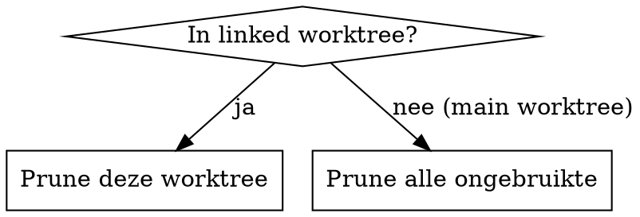

# /bonsai

Worktree lifecycle manager. Twee commando's:

- **`/bonsai new <branch> [prompt]`**: maak worktree + branch, zet een `cd <worktree> && claude "..."` commando op je clipboard zodat je het in een nieuwe pane/tab/app naar keuze kunt plakken
- **`/bonsai prune`**: ruim worktrees op (context-afhankelijk)

## Vereisten

- **macOS**. `/bonsai new` gebruikt `pbcopy` om het start-commando op het clipboard te zetten. `/bonsai prune` werkt overal waar git draait.
- **`claude` op je PATH** (of een eigen wrapper, zie hieronder).

### Optioneel: eigen Claude launcher via `CLAUDE_CLI`

Gebruik je een alias of wrapper rond `claude` (bijvoorbeeld om logging, flags of een bepaald model te injecteren)? Zet de env var `CLAUDE_CLI` in je shell rc:

```bash
export CLAUDE_CLI=mijn-wrapper
```

Bonsai zet de letterlijke string `${CLAUDE_CLI:-claude}` in het clipboard-commando, zodat de doel-shell de var op plak-moment evalueert. Geen eigen wrapper? Dan hoef je niks te doen.

## Kernprincipe

Worktree verwijderen en branch prunen zijn **twee gescheiden acties**:

- **Worktree verwijderen**: veilig zolang er geen uncommitted changes zijn. De branch blijft bestaan.
- **Lokale branch prunen**: alleen als het werk aantoonbaar geïntegreerd is in de default branch.

Bij twijfel: in overleg. Nooit stilzwijgend werk weggooien.

## Gedeeld: repo root en default branch

```bash
# Repo root (altijd gebruiken als basis voor worktree paden)
REPO_ROOT=$(git worktree list | head -1 | awk '{print $1}')

# Default branch
DEFAULT=$(git symbolic-ref refs/remotes/origin/HEAD | sed 's|refs/remotes/origin/||')
```

Fallback voor default branch: check welke van `main` of `master` bestaat.

## Directory conventie

Alle worktrees leven in `$REPO_ROOT/worktrees/<naam>/`. Dit is de conventie, geen suggestie.

- **grow** maakt altijd aan in `$REPO_ROOT/worktrees/<branch>`
- **prune** herkent linked worktrees via `git worktree list`. Worktrees buiten `$REPO_ROOT/worktrees/` zijn onverwacht: meld ze maar raak ze niet aan.
- **gitignore**: `$REPO_ROOT/worktrees/.gitignore` bevat alleen `*` (negeert alles inclusief zichzelf). Wordt aangemaakt bij de eerste `new` als het nog niet bestaat. Voorkomt dirty state in de parent repo zonder geneste checkouts te beïnvloeden.

## Dev server poorten

De main worktree draait dev servers op de standaard poort (meestal 3000). Worktrees moeten een andere poort gebruiken om conflicten te voorkomen.

**Poortberekening**: deterministisch op basis van de worktree naam, in het bereik 3100-3999:

```bash
WORKTREE_PORT=$(( 3100 + $(echo -n "<worktree-naam>" | cksum | awk '{print $1}') % 900 ))
```

**Gebruik**: de meeste dev servers respecteren de `PORT` env var. De agent in de nieuwe worktree moet zelf uitzoeken welk commando de dev server start in dit project (`bin/dev`, `npm run dev`, `rails server`, `go run`, `uvicorn`, etc.) en de `PORT` waarde meegeven.

De berekende poort wordt opgenomen in de start prompt (zie stap 2) zodat de worktree agent weet welke poort te gebruiken. De agent hoeft de poort niet zelf te berekenen.

---

## /bonsai new

Maak een nieuwe worktree met branch en zet een start-commando voor de Claude sessie op het clipboard.

**Input**: branch naam (optioneel), start prompt (optioneel), base ref (optioneel, default `origin/$DEFAULT`).

Wanneer geen branch naam is meegegeven, leid er een af uit de context:
- GitHub issue URL in het gesprek → gebruik issue titel als basis
- Lopend onderwerp → beschrijf het doel in 2-3 woorden
- Naamgeving: kebab-case, intent-revealing, geen prefixes (`feature/`, `fix/`). Bijvoorbeeld: `digital-twin-chart`, `android-permissions`, `s2-reconnect-fix`.

Wanneer geen start prompt is meegegeven maar er is wel context (issue URL, beschrijving van het werk), genereer een beknopte prompt die de nieuwe Claude sessie op gang helpt.

De start prompt bevat altijd de worktree-poort (zie "Dev server poorten"). Voeg toe aan elke gegenereerde prompt: `Dev server poort voor deze worktree: PORT=<berekende-poort>. Zoek uit wat je moet doen om de dev server van dit project te starten en geef PORT=<poort> mee. Gebruik NOOIT de standaard poort, de main worktree draait daar al op.`

### Stap 0: Preconditie check

`/bonsai new` zet het start-commando op het clipboard via `pbcopy` (macOS-only). Check dat het beschikbaar is voordat je iets aanmaakt:

```bash
if ! command -v pbcopy >/dev/null 2>&1; then
  echo "pbcopy niet gevonden. /bonsai new vereist macOS."
  exit 1
fi
```

Faalt het: stop meteen, geen worktree aanmaken, geen half werk achterlaten.

### Stap 1: Maak worktree

```bash
# Self-ignoring gitignore (alleen bij eerste worktree)
[ -f $REPO_ROOT/worktrees/.gitignore ] || echo '*' > $REPO_ROOT/worktrees/.gitignore

git worktree add $REPO_ROOT/worktrees/<dir> -b <branch> origin/$DEFAULT
```

Gebruik altijd het absolute pad via `$REPO_ROOT`, ongeacht de huidige CWD. Directory naam = branch naam. Slashes in branch namen worden dashes in de directory (bijv. `feature/foo` → `worktrees/feature-foo`).

### Stap 1b: Kopieer project-bestanden

Sommige projecten hebben bestanden nodig die niet in git staan (databases, `.env`, etc.).

**Als `$REPO_ROOT/.bonsai` niet bestaat**: scan `.gitignore`'d bestanden die wel bestaan in de working tree. Typische kandidaten: `*.sqlite3`, `*.db`, `.env*`, `config/master.key`, `credentials.yml.enc`. Kandidaten gevonden? Schrijf de `.bonsai` direct, toon wat erin staat, en ga door. Geen vragen, geen bevestiging. De user heeft `/bonsai new` gezegd, niet "analyseer of ik bestanden nodig heb". Geen kandidaten gevonden? Sla deze stap over zonder `.bonsai` aan te maken.

`.bonsai` staat in de global gitignore (`~/.gitignore`), dus het bestand mag vrijuit aangemaakt en aangepast worden zonder de repo dirty te maken.

**Als `$REPO_ROOT/.bonsai` bestaat**: kopieer de genoemde bestanden van de main worktree naar de nieuwe.

**`.bonsai` formaat**: plain text, één pad per regel relatief aan de project root. Lege regels en `#` commentaar worden genegeerd.

```
# SQLite database nodig om te serveren
db/development.sqlite3

# Environment variabelen
.env.local
```

```bash
if [ -f $REPO_ROOT/.bonsai ]; then
  grep -v '^\s*#' $REPO_ROOT/.bonsai | grep -v '^\s*$' | while read -r file; do
    if [ -f "$REPO_ROOT/$file" ]; then
      mkdir -p "$(dirname "$WORKTREE_PATH/$file")"
      cp "$REPO_ROOT/$file" "$WORKTREE_PATH/$file"
    fi
  done
fi
```

Bestanden die niet bestaan worden stilzwijgend overgeslagen. Geen foutmelding, geen blocker.

### Stap 1c: Bereken worktree-poort

```bash
WORKTREE_PORT=$(( 3100 + $(echo -n "<worktree-naam>" | cksum | awk '{print $1}') % 900 ))
```

Voeg de poort toe aan de start prompt (zie stap 2).

### Stap 1d: Installeer dependencies

`node_modules`, `vendor/bundle` en vergelijkbare dependency directories worden niet door git getrackt en niet door `.bonsai` gekopieerd (te groot, symlinks, platform-specifiek). Zonder installatie faalt elke test-run of dev server op ontbrekende packages, en de failure modes zijn verraderlijk: "vite kan niet builden" in plaats van "dependencies ontbreken". Het kost een paar minuten bij creatie, maar voorkomt tien minuten debuggen later.

Scan de worktree tot twee niveaus diep naar `package.json` en `Gemfile`. Voor elke match: draai het bijbehorende install commando in die directory.

```bash
find "$WORKTREE_PATH" -maxdepth 2 -name "package.json" -not -path "*/node_modules/*" | while read -r manifest; do
  dir=$(dirname "$manifest")
  echo "Installing npm dependencies in $dir..."
  (cd "$dir" && npm install)
done

find "$WORKTREE_PATH" -maxdepth 2 -name "Gemfile" -not -path "*/vendor/*" | while read -r manifest; do
  dir=$(dirname "$manifest")
  echo "Installing bundler dependencies in $dir..."
  (cd "$dir" && bundle install)
done
```

Install failures (missing tool, network error) worden gemeld maar blokkeren niet: de worktree is aangemaakt en de user kan handmatig herstellen. Andere package managers (pnpm, yarn, poetry, cargo, go mod) zijn nog niet gedekt; voeg ze toe wanneer ze in een project voorkomen.

### Stap 2: Zet start-commando op het clipboard

Bouw een `cd <worktree> && claude "<prompt>"` commando en pipe het naar `pbcopy`. De prompt zit in een single-quoted heredoc binnen het commando, dus de doel-shell hoeft niets te escapen en de prompt mag vrij multi-line zijn met `$`, `!`, backticks et cetera. `${CLAUDE_CLI:-claude}` blijft letterlijk in het clipboard zodat de doel-shell de var op plak-moment evalueert.

Met start prompt:

```bash
pbcopy <<CLIP
cd <worktree-path> && \${CLAUDE_CLI:-claude} "\$(cat <<'BONSAI_PROMPT'
<start-prompt>

Dev server poort voor deze worktree: PORT=<WORKTREE_PORT>. Zoek uit wat je moet doen om de dev server van dit project te starten en geef PORT=<WORKTREE_PORT> mee. Gebruik NOOIT de standaard poort, de main worktree draait daar al op.
BONSAI_PROMPT
)"
CLIP
```

Zonder start prompt:

```bash
pbcopy <<CLIP
cd <worktree-path> && \${CLAUDE_CLI:-claude}
CLIP
```

De buitenste heredoc is unquoted, zodat `<worktree-path>` (door bonsai zelf gevuld) gesubstitueerd wordt; de `$`-tekens die letterlijk op het clipboard moeten landen zijn ge-escaped met backslash. De binnenste heredoc-delimiter `BONSAI_PROMPT` is single-quoted, zodat de doel-shell niets in de prompt expandeert.

### Stap 3: Bevestiging

> Worktree `<branch>` aangemaakt in `worktrees/<dir>`. Start-commando staat op je clipboard: plak het in een nieuwe pane/tab/terminal naar keuze.

---

## /bonsai prune

Detecteert automatisch de modus op basis van context:



Linked worktree detectie: `git rev-parse --git-dir` bevat `.git/worktrees/`.

---

### Prune: enkele worktree (vanuit linked worktree)

#### Safety checks

Voer alle checks uit en toon als één overzicht.

**Uncommitted changes:**
```bash
git status --porcelain
```
Output aanwezig → **blocker**.

**Unpushed commits:**
```bash
git log origin/<branch>..<branch> --oneline 2>/dev/null
```

Als `origin/<branch>` niet bestaat:
```bash
git ls-remote --heads origin <branch>
```

- Geen remote branch + lokale commits → **blocker**: "Branch bestaat alleen lokaal. Push eerst."
- Remote branch + unpushed commits → **blocker**: "Unpushed commits. Push eerst."

**Is het werk geïntegreerd?** (bepaalt of lokale branch gepruned mag worden, GEEN blocker voor worktree)

```bash
# Is branch HEAD ancestor van origin/$DEFAULT?
git merge-base --is-ancestor <branch> origin/$DEFAULT
# Exit 0 = geïntegreerd

# Vangnet voor zeldzame squash merges:
gh pr list --head <branch> --state merged --json number,title --jq '.[0]'
```

#### Toon resultaat

```
Branch:    my-feature
Worktree:  worktrees/my-feature
Status:    ✓ Clean
Remote:    ✓ Gepusht
Werk:      ✓ Geïntegreerd (PR #1234 gemerged)

→ Worktree verwijderen en lokale branch prunen.
```

Varianten:
- `○ Niet geïntegreerd (PR #1234 open)` → "Worktree verwijderen. Lokale branch blijft."
- `✗ Uncommitted changes` → "Kan niet opruimen." Stop.

#### Opruimen

Eerst terug naar de repo root, zodat de CWD blijft bestaan na verwijdering:

```bash
cd $REPO_ROOT
git worktree remove <worktree-path>    # nooit --force
git branch -d <branch>                 # alleen als geïntegreerd, nooit -D
git worktree prune
git worktree list
```

> 🌳✂️ Worktree `<branch>` opgeruimd. Sluit deze sessie, de werkcontext is weg.

---

### Prune: alle worktrees (vanuit main worktree)

#### Inventariseer

```bash
git worktree list
```

`worktrees/$DEFAULT` is per definitie overbodig.

#### Classificeer per worktree

Voer de safety checks (hierboven) uit per worktree. Voor worktrees die niet de CWD zijn, gebruik `cd <path> && git status --porcelain` (nooit `git -C`).

Classificatie:

- **Geïntegreerd + clean** → verwijderen (automatisch, geen bevestiging)
- **Geïntegreerd + dirty of extra commits** → vraag bevestiging
- **Niet geïntegreerd, open PR** → worktree mag weg, branch blijft. Meld PR.
- **Niet geïntegreerd, geen PR** → bewaren. Niet voorstellen om te verwijderen.
- **Blockers** → overslaan, melden

#### Toon overzicht

```
Worktree                  Branch            Actie
worktrees/master          master            Verwijderd (redundant)
worktrees/my-feature      my-feature        Verwijderd (gemerged)
worktrees/open-work       open-work         Bewaren (PR #123 open)
worktrees/experiment      experiment        Bewaren (niet geïntegreerd)
```

#### Main dir naar default branch

Als de main working directory niet op `$DEFAULT` staat:

```bash
git switch $DEFAULT
```

#### Resultaat

Tabel van resterende worktrees:

```
| Directory          | Branch (als afwijkend) | Laatste activiteit | Status                |
|--------------------|------------------------|--------------------|------------------------|
| (main)             |                        |                    | master ✓              |
| android-update     |                        | 2 dagen geleden    | PR #7193 (open, 3↑)  |
| digital-twin-demo  |                        | 3 weken geleden    | Lokaal werk (5↑)     |
```

Kolommen:
- **Laatste activiteit**: `git log -1 --format="%cr" <branch>`
- **Status**: PR referentie, commits ahead (↑) / behind (↓) via `git rev-list --left-right --count origin/$DEFAULT...<branch>`, dirty indicator via `cd <worktree-path> && git status --porcelain`

---

## .bonsai detectie (auto-trigger)

Wanneer je een `.bonsai` bestand tegenkomt in een repository (via `git status`, `ls`, file exploration), check of het bestand geignored wordt:

```bash
git check-ignore -q .bonsai
```

Exit 0 = geignored (goed). Exit 1 = niet geignored (probleem).

**Niet geignored?** Meld aan de user:

> `.bonsai` staat niet in je gitignore. Dit bestand bevat paden naar lokale bestanden (databases, keys) en hoort niet in de repo. Voeg `.bonsai` toe aan je global gitignore (`git config --global core.excludesfile` toont het pad) of aan de `.gitignore` van dit project.

Niet stilzwijgend fixen. De user moet weten dat de setup incompleet is, zodat het op al hun machines klopt.
