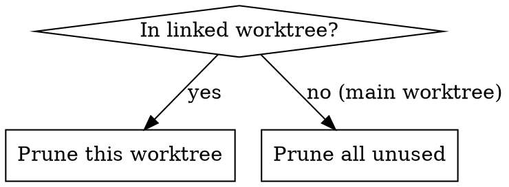

# /bonsai

Worktree lifecycle manager. Two commands:

- **`/bonsai new <branch> [prompt]`**: create worktree + branch, place a `cd <worktree> && claude "..."` command on your clipboard so you can paste it into a new pane/tab/app of your choice
- **`/bonsai prune`**: clean up worktrees (context-dependent)

## Requirements

- **macOS**. `/bonsai new` uses `pbcopy` to put the start command on the clipboard. `/bonsai prune` works anywhere git runs.
- **`claude` on your PATH** (or a custom wrapper, see below).

### Optional: custom Claude launcher via `CLAUDE_CLI`

Do you use an alias or wrapper around `claude` (for example to inject logging, flags or a particular model)? Set the env var `CLAUDE_CLI` in your shell rc:

```bash
export CLAUDE_CLI=my-wrapper
```

Bonsai puts the literal string `${CLAUDE_CLI:-claude}` in the clipboard command, so the target shell evaluates the var at paste time. No custom wrapper? Then you do not need to do anything.

## Core principle

Removing a worktree and pruning a branch are **two separate actions**:

- **Remove worktree**: safe as long as there are no uncommitted changes. The branch keeps existing.
- **Prune local branch**: only when the work is demonstrably integrated into the default branch.

When in doubt: confer. Never silently throw work away.

## Shared: repo root and default branch

```bash
# Repo root (always use as the basis for worktree paths)
REPO_ROOT=$(git worktree list | head -1 | awk '{print $1}')

# Default branch
DEFAULT=$(git symbolic-ref refs/remotes/origin/HEAD | sed 's|refs/remotes/origin/||')
```

Fallback for default branch: check which of `main` or `master` exists.

## Directory convention

All worktrees live in `$REPO_ROOT/worktrees/<name>/`. This is the convention, not a suggestion.

- **grow** always creates in `$REPO_ROOT/worktrees/<branch>`
- **prune** recognises linked worktrees via `git worktree list`. Worktrees outside `$REPO_ROOT/worktrees/` are unexpected: report them but do not touch them.
- **gitignore**: `$REPO_ROOT/worktrees/.gitignore` contains only `*` (ignores everything including itself). Created on the first `new` if it does not yet exist. Prevents dirty state in the parent repo without affecting nested checkouts.

## Dev server ports

The main worktree runs dev servers on the standard port (usually 3000). Worktrees must use a different port to prevent conflicts.

**Port calculation**: deterministic based on the worktree name, in the range 3100-3999:

```bash
WORKTREE_PORT=$(( 3100 + $(echo -n "<worktree-name>" | cksum | awk '{print $1}') % 900 ))
```

**Usage**: most dev servers respect the `PORT` env var. The agent in the new worktree must figure out itself which command starts the dev server in this project (`bin/dev`, `npm run dev`, `rails server`, `go run`, `uvicorn`, etc.) and pass along the `PORT` value.

The calculated port is included in the start prompt (see step 2) so the worktree agent knows which port to use. The agent does not have to calculate the port itself.

---

## /bonsai new

Create a new worktree with a branch and place a start command for the Claude session on the clipboard.

**Input**: branch name (optional), start prompt (optional), base ref (optional, default `origin/$DEFAULT`).

When no branch name is provided, derive one from context:
- GitHub issue URL in the conversation, use the issue title as a basis
- Ongoing topic, describe the goal in 2-3 words
- Naming: kebab-case, intent-revealing, no prefixes (`feature/`, `fix/`). For example: `digital-twin-chart`, `android-permissions`, `s2-reconnect-fix`.

When no start prompt is provided but there is context (issue URL, description of the work), generate a concise prompt that gets the new Claude session going.

The start prompt always contains the worktree port (see "Dev server ports"). Add to every generated prompt: `Dev server poort voor deze worktree: PORT=<berekende-poort>. Zoek uit wat je moet doen om de dev server van dit project te starten en geef PORT=<poort> mee. Gebruik NOOIT de standaard poort, de main worktree draait daar al op.`

### Step 0: Precondition check

`/bonsai new` puts the start command on the clipboard via `pbcopy` (macOS-only). Check that it is available before creating anything:

```bash
if ! command -v pbcopy >/dev/null 2>&1; then
  echo "pbcopy niet gevonden. /bonsai new vereist macOS."
  exit 1
fi
```

If it fails: stop immediately, do not create a worktree, do not leave half-done work behind.

### Step 1: Create worktree

```bash
# Self-ignoring gitignore (only on first worktree)
[ -f $REPO_ROOT/worktrees/.gitignore ] || echo '*' > $REPO_ROOT/worktrees/.gitignore

git worktree add $REPO_ROOT/worktrees/<dir> -b <branch> origin/$DEFAULT
```

Always use the absolute path via `$REPO_ROOT`, regardless of the current CWD. Directory name = branch name. Slashes in branch names become dashes in the directory (e.g. `feature/foo` becomes `worktrees/feature-foo`).

### Step 1b: Copy project files

Some projects need files that are not in git (databases, `.env`, etc.).

**If `$REPO_ROOT/.bonsai` does not exist**: scan `.gitignore`'d files that do exist in the working tree. Typical candidates: `*.sqlite3`, `*.db`, `.env*`, `config/master.key`, `credentials.yml.enc`. Found candidates? Write the `.bonsai` directly, show what it contains, and proceed. No questions, no confirmation. The user said `/bonsai new`, not "analyse whether I need files". No candidates found? Skip this step without creating a `.bonsai`.

`.bonsai` lives in the global gitignore (`~/.gitignore`), so the file may be freely created and modified without making the repo dirty.

**If `$REPO_ROOT/.bonsai` exists**: copy the listed files from the main worktree to the new one.

**`.bonsai` format**: plain text, one path per line relative to the project root. Empty lines and `#` comments are ignored.

```
# SQLite database needed to serve
db/development.sqlite3

# Environment variables
.env.local
```

```bash
if [ -f $REPO_ROOT/.bonsai ]; then
  grep -v '^\s*#' $REPO_ROOT/.bonsai | grep -v '^\s*$' | while read -r file; do
    if [ -f "$REPO_ROOT/$file" ]; then
      mkdir -p "$(dirname "$WORKTREE_PATH/$file")"
      cp "$REPO_ROOT/$file" "$WORKTREE_PATH/$file"
    fi
  done
fi
```

Files that do not exist are silently skipped. No error message, no blocker.

### Step 1c: Calculate worktree port

```bash
WORKTREE_PORT=$(( 3100 + $(echo -n "<worktree-name>" | cksum | awk '{print $1}') % 900 ))
```

Add the port to the start prompt (see step 2).

### Step 1d: Install dependencies

`node_modules`, `vendor/bundle` and similar dependency directories are not tracked by git and not copied by `.bonsai` (too big, symlinks, platform-specific). Without installation every test run or dev server fails on missing packages, and the failure modes are treacherous: "vite cannot build" instead of "dependencies missing". It costs a few minutes at creation time, but prevents ten minutes of debugging later.

Scan the worktree two levels deep for `package.json` and `Gemfile`. For every match: run the corresponding install command in that directory.

```bash
find "$WORKTREE_PATH" -maxdepth 2 -name "package.json" -not -path "*/node_modules/*" | while read -r manifest; do
  dir=$(dirname "$manifest")
  echo "Installing npm dependencies in $dir..."
  (cd "$dir" && npm install)
done

find "$WORKTREE_PATH" -maxdepth 2 -name "Gemfile" -not -path "*/vendor/*" | while read -r manifest; do
  dir=$(dirname "$manifest")
  echo "Installing bundler dependencies in $dir..."
  (cd "$dir" && bundle install)
done
```

Install failures (missing tool, network error) are reported but do not block: the worktree has been created and the user can recover manually. Other package managers (pnpm, yarn, poetry, cargo, go mod) are not yet covered; add them when they appear in a project.

### Step 2: Place start command on the clipboard

Build a `cd <worktree> && claude "<prompt>"` command and pipe it to `pbcopy`. The prompt sits in a single-quoted heredoc inside the command, so the target shell does not have to escape anything and the prompt may freely be multi-line with `$`, `!`, backticks et cetera. `${CLAUDE_CLI:-claude}` stays literal in the clipboard so the target shell evaluates the var at paste time.

With start prompt:

```bash
pbcopy <<CLIP
cd <worktree-path> && \${CLAUDE_CLI:-claude} "\$(cat <<'BONSAI_PROMPT'
<start-prompt>

Dev server poort voor deze worktree: PORT=<WORKTREE_PORT>. Zoek uit wat je moet doen om de dev server van dit project te starten en geef PORT=<WORKTREE_PORT> mee. Gebruik NOOIT de standaard poort, de main worktree draait daar al op.
BONSAI_PROMPT
)"
CLIP
```

Without start prompt:

```bash
pbcopy <<CLIP
cd <worktree-path> && \${CLAUDE_CLI:-claude}
CLIP
```

The outer heredoc is unquoted, so `<worktree-path>` (filled in by bonsai itself) gets substituted; the `$` characters that must land literally on the clipboard are escaped with a backslash. The inner heredoc delimiter `BONSAI_PROMPT` is single-quoted, so the target shell expands nothing in the prompt.

### Step 3: Confirmation

> Worktree `<branch>` created in `worktrees/<dir>`. Start command is on your clipboard: paste it into a new pane/tab/terminal of your choice.

---

## /bonsai prune

Automatically detects the mode based on context:



Linked worktree detection: `git rev-parse --git-dir` contains `.git/worktrees/`.

---

### Prune: single worktree (from a linked worktree)

#### Safety checks

Run all checks and show as one overview.

**Uncommitted changes:**
```bash
git status --porcelain
```
Output present, **blocker**.

**Unpushed commits:**
```bash
git log origin/<branch>..<branch> --oneline 2>/dev/null
```

If `origin/<branch>` does not exist:
```bash
git ls-remote --heads origin <branch>
```

- No remote branch + local commits, **blocker**: "Branch only exists locally. Push first."
- Remote branch + unpushed commits, **blocker**: "Unpushed commits. Push first."

**Is the work integrated?** (determines whether the local branch may be pruned, NOT a blocker for the worktree)

```bash
# Is branch HEAD an ancestor of origin/$DEFAULT?
git merge-base --is-ancestor <branch> origin/$DEFAULT
# Exit 0 = integrated

# Safety net for rare squash merges:
gh pr list --head <branch> --state merged --json number,title --jq '.[0]'
```

#### Show result

```
Branch:    my-feature
Worktree:  worktrees/my-feature
Status:    ✓ Clean
Remote:    ✓ Pushed
Work:      ✓ Integrated (PR #1234 merged)

→ Remove worktree and prune local branch.
```

Variants:
- `○ Not integrated (PR #1234 open)`, "Remove worktree. Local branch stays."
- `✗ Uncommitted changes`, "Cannot clean up." Stop.

#### Cleanup

First go back to the repo root, so the CWD keeps existing after removal:

```bash
cd $REPO_ROOT
git worktree remove <worktree-path>    # never --force
git branch -d <branch>                 # only when integrated, never -D
git worktree prune
git worktree list
```

> 🌳✂️ Worktree `<branch>` cleaned up. Close this session, the work context is gone.

---

### Prune: all worktrees (from the main worktree)

#### Inventory

```bash
git worktree list
```

`worktrees/$DEFAULT` is by definition redundant.

#### Classify per worktree

Run the safety checks (above) per worktree. For worktrees that are not the CWD, use `cd <path> && git status --porcelain` (never `git -C`).

Classification:

- **Integrated + clean**, remove (automatic, no confirmation)
- **Integrated + dirty or extra commits**, ask for confirmation
- **Not integrated, open PR**, worktree may go, branch stays. Report PR.
- **Not integrated, no PR**, keep. Do not propose removal.
- **Blockers**, skip, report

#### Show overview

```
Worktree                  Branch            Action
worktrees/master          master            Removed (redundant)
worktrees/my-feature      my-feature        Removed (merged)
worktrees/open-work       open-work         Keep (PR #123 open)
worktrees/experiment      experiment        Keep (not integrated)
```

#### Main dir to default branch

If the main working directory is not on `$DEFAULT`:

```bash
git switch $DEFAULT
```

#### Result

Table of remaining worktrees:

```
| Directory          | Branch (when different) | Last activity      | Status                |
|--------------------|-------------------------|--------------------|------------------------|
| (main)             |                         |                    | master ✓              |
| android-update     |                         | 2 days ago         | PR #7193 (open, 3↑)  |
| digital-twin-demo  |                         | 3 weeks ago        | Local work (5↑)      |
```

Columns:
- **Last activity**: `git log -1 --format="%cr" <branch>`
- **Status**: PR reference, commits ahead (↑) / behind (↓) via `git rev-list --left-right --count origin/$DEFAULT...<branch>`, dirty indicator via `cd <worktree-path> && git status --porcelain`

---

## .bonsai detection (auto-trigger)

When you encounter a `.bonsai` file in a repository (via `git status`, `ls`, file exploration), check whether the file is being ignored:

```bash
git check-ignore -q .bonsai
```

Exit 0 = ignored (good). Exit 1 = not ignored (problem).

**Not ignored?** Report to the user:

> `.bonsai` is not in your gitignore. This file contains paths to local files (databases, keys) and does not belong in the repo. Add `.bonsai` to your global gitignore (`git config --global core.excludesfile` shows the path) or to this project's `.gitignore`.

Do not silently fix. The user must know that the setup is incomplete, so it is correct on all of their machines.
