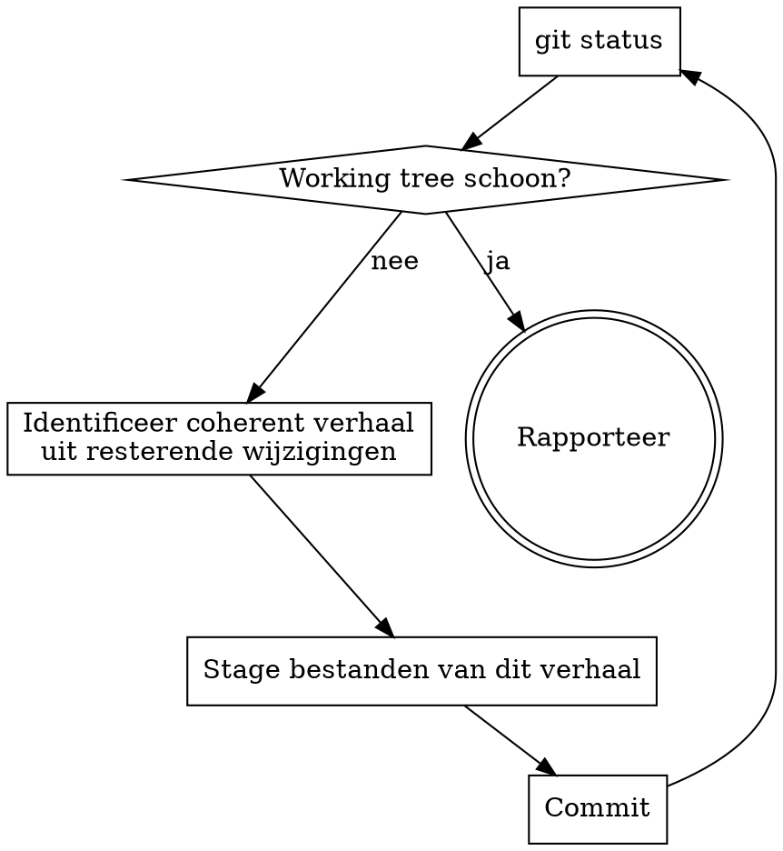

<post-update-broadcast>
BEFORE doing the actual work below, run this one-time check:

```bash
node "${CLAUDE_PLUGIN_ROOT}/bin/check-broadcast"
```

If the command produces output, the gitgit plugin was updated since the
last time you saw the broadcast on this machine. Show the output verbatim
in a markdown block, prefixed with one short sentence ("gitgit was updated;
here is what changed."). Then continue with the rest of this skill.

If the command produces no output, say nothing about updates and proceed.

The helper writes the sentinel only when stdout was non-empty, so a silent
run does not mark the version as seen. `/gitgit:whats-new` re-shows the
section on demand without touching the sentinel.
</post-update-broadcast>

# Commit All The Things

Commit alle uncommitted wijzigingen in de working tree, gegroepeerd in logische commits met beschrijvende messages.

## Wanneer

- De working tree bevat wijzigingen van meerdere sessies of taken
- De user wil alles opruimen zonder zelf te sorteren
- Tegenovergestelde van `commit-snipe` (die alleen de huidige sessie commit)

## Invocatie is intent

`/gitgit:commit-all-the-things` IS de opdracht. Geen plan presenteren, geen bevestiging per commit, geen tussentijdse vragen. Doorwerken tot de working tree schoon is.

## Workflow



## Verhaal-herkenning

Lees de diffs, niet alleen bestandsnamen. Signalen dat wijzigingen bij hetzelfde verhaal horen:

- Een script + zijn configuratie-entry (bijv. hook + settings.json hunk)
- Bestanden in dezelfde feature-directory
- Een skill SKILL.md + gerelateerde bestanden
- Verwijderde bestanden van dezelfde opruimactie
- Wijzigingen aan hetzelfde conceptuele onderdeel

## Commit volgorde

Infra en opruiming eerst, features daarna:

1. Verwijderingen en opruiming
2. Config en settings
3. Nieuwe features (hooks, skills, plannen)
4. Documentatie

## Staging

**Bestanden zijn een implementatiedetail.** De eenheid is de logische wijziging, niet het bestand. Gebruik `git add -p` om alleen de hunks te stagen die bij het huidige verhaal horen. Een bestand met wijzigingen voor twee verhalen wordt over twee commits gesplitst.

```bash
# Voorbeeld: twee hunks in settings.json, alleen de tweede stagen
printf 'n\ny\n' | git add -p settings.json
```

Verifieer elke staging met `git diff --cached --stat` voordat je commit.

## Commits

Volg de commit-message conventies in project- en user-CLAUDE.md. Deze skill bepaalt alleen WAT er per commit gegroepeerd wordt, niet HOE de commit gemaakt wordt.

## Regels

- **Nooit `git add .` of `git add -A`.** Altijd expliciete paden of hunks.
- **Nooit pushen.** Alleen committen. Push is een aparte actie.
- **Geen vragen.** Doorwerken tot de working tree schoon is.
- **Eén verhaal per commit.** Liever te veel kleine commits dan te weinig grote.
- **Bij twijfel over groepering:** splits. Twee gerelateerde commits zijn beter dan één incoherente.

## Rapportage

Na afloop: korte tabel met elke commit (hash + message). Geen uitleg per commit, de messages spreken voor zich.
