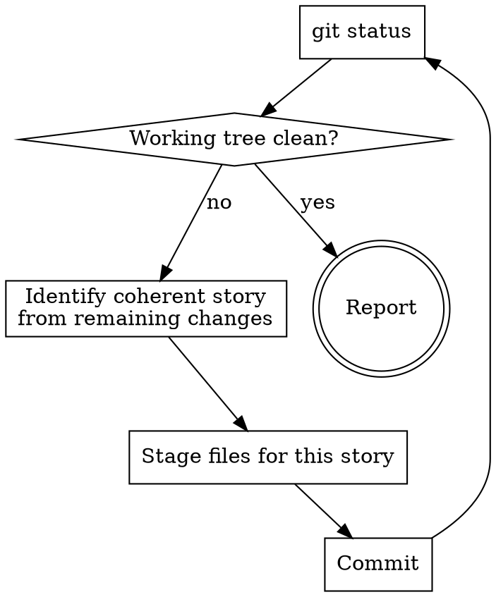

<post-update-broadcast>
BEFORE doing the actual work below, run this one-time check:

```bash
node "${CLAUDE_PLUGIN_ROOT}/bin/check-broadcast"
```

If the command produces output, the gitgit plugin was updated since the
last time you saw the broadcast on this machine. Show the output verbatim
in a markdown block, prefixed with one short sentence ("gitgit was updated;
here is what changed."). Then continue with the rest of this skill.

If the command produces no output, say nothing about updates and proceed.

The helper writes the sentinel only when stdout was non-empty, so a silent
run does not mark the version as seen. `/leclause:whats-new gitgit`
re-shows the section on demand without touching the sentinel.
</post-update-broadcast>

# Commit All The Things

Commit all uncommitted changes in the working tree, grouped into logical commits with descriptive messages.

## When

- The working tree contains changes from multiple sessions or tasks
- The user wants to clean everything up without sorting through it themselves
- Opposite of `commit-snipe` (which only commits the current session)

## Invocation is intent

`/gitgit:commit-all-the-things` IS the instruction. Do not present a plan, do not confirm per commit, do not ask intermediate questions. Keep working until the working tree is clean.

## Workflow



## Story recognition

Read the diffs, not just file names. Signals that changes belong to the same story:

- A script plus its configuration entry (e.g. hook plus settings.json hunk)
- Files in the same feature directory
- A skill SKILL.md plus related files
- Deleted files from the same cleanup action
- Changes to the same conceptual component

## Commit order

Infra and cleanup first, features after:

1. Deletions and cleanup
2. Config and settings
3. New features (hooks, skills, plans)
4. Documentation

## Staging

**Files are an implementation detail.** The unit is the logical change, not the file. Use `git add -p` to stage only the hunks that belong to the current story. A file with changes for two stories is split across two commits.

```bash
# Example: two hunks in settings.json, stage only the second
printf 'n\ny\n' | git add -p settings.json
```

Verify every staging with `git diff --cached --stat` before you commit.

## Commits

Follow the commit message conventions in project- and user-CLAUDE.md. This skill determines only WHAT is grouped per commit, not HOW the commit is made.

## Rules

- **Never `git add .` or `git add -A`.** Always explicit paths or hunks.
- **Never push.** Only commit. Push is a separate action.
- **No questions.** Keep working until the working tree is clean.
- **One story per commit.** Better too many small commits than too few large ones.
- **When in doubt about grouping:** split. Two related commits are better than one incoherent one.

## Reporting

When done: short table with each commit (hash plus message). No explanation per commit, the messages speak for themselves.
