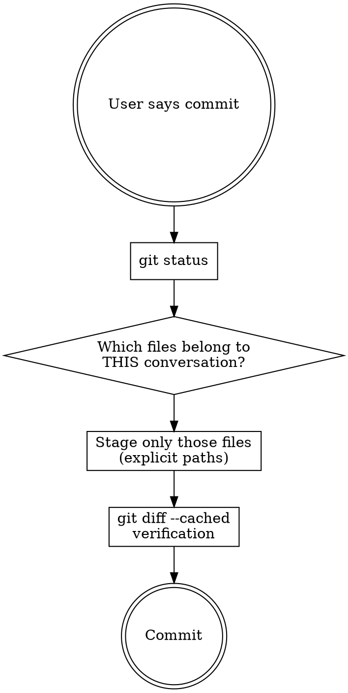

# Commit Snipe

Precision commits from a working tree with mixed changes. Stage only what belongs to the current task, leave the rest untouched.

## When

- `git status` shows changes that are NOT from the current work
- Multiple logically independent tasks have touched the working tree
- The user says "commit" without specifying which files

## Core technique

1. **`git status`** review all changes in the working tree
2. **Conversation analysis** which files did you create, edit, or generate in THIS session?
3. **Selective staging** `git add` with explicit file names
4. **Verification** `git diff --cached --stat` to check that only the right files are staged
5. **Commit** follow existing conventions from the project- and user-CLAUDE.md

## Rules

- **Invocation IS commit intent.** `/gitgit:commit-snipe` means "commit now". Do not ask for confirmation, no "wil je dit committen?". The user has already given their intent by invoking the skill.
- **When in doubt, do NOT stage.** A file you cannot confidently trace back to the current work does not belong in the commit.
- **Never `git add .` or `git add -A`.** Always explicit paths or hunks.
- **Files are an implementation detail.** The snipe might be two lines
  inside a file with forty lines of changes. Use `git add -p`
  to stage only the hunks that belong to the current work. It is about
  the functionality, not the file.
- **No questions about which files.** The conversation context IS the source of truth. You know which changes you touched.
- **Count generated files.** If you edited an SVG and generated PNGs from it, the PNGs belong with it.
- **Multiple logical units = multiple commits.** If the current work consists of independent steps, snipe per step.
- **Snipe pre-existing changes too.** When the user explicitly says "wat er nog staat" or similar, commit all uncommitted changes. Group them into logical commits, even when they are not from the current session.

## Anti-patterns

| Wrong | Correct |
|------|---------|
| Stage everything because the user said "commit" | Only files from the current work |
| Vragen "welke bestanden wil je committen?" | Determine yourself from conversation context |
| Forget files you generated indirectly | Include all output: generated, compiled, derived files |
| `git add -A` and then unstage what does not belong | `git add` with explicit paths |
| Bring along unmodified files "by accident" | `git diff --cached --stat` verifies what is actually staged |
