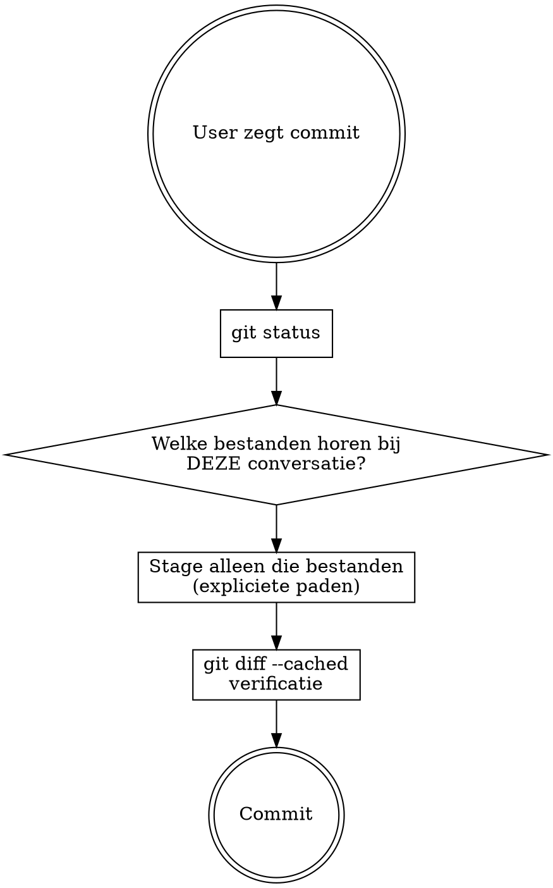

# Commit Snipe

Precisie-commits uit een working tree met gemixte wijzigingen. Stage alleen wat bij de huidige taak hoort, laat de rest onaangeraakt.

## Wanneer

- `git status` toont wijzigingen die NIET van het huidige werk zijn
- Meerdere logisch onafhankelijke taken hebben de working tree aangeraakt
- De gebruiker zegt "commit" zonder te specificeren welke bestanden

## Core techniek

1. **`git status`** bekijk alle wijzigingen in de working tree
2. **Conversatie-analyse** welke bestanden heb je in DEZE sessie aangemaakt, bewerkt, of gegenereerd?
3. **Selectief stagen** `git add` met expliciete bestandsnamen
4. **Verificatie** `git diff --cached --stat` om te checken dat alleen de juiste bestanden gestaged zijn
5. **Commit** volg bestaande conventies uit de project- en user-CLAUDE.md

## Regels

- **Invocatie IS commit intent.** `/commit-snipe` betekent "commit nu". Geen bevestiging vragen, geen "wil je dit committen?". De user heeft zijn intent al gegeven door de skill aan te roepen.
- **Bij twijfel, NIET stagen.** Een bestand dat je niet zeker kunt herleiden naar het huidige werk hoort niet in de commit.
- **Nooit `git add .` of `git add -A`.** Altijd expliciete paden of hunks.
- **Bestanden zijn een implementatiedetail.** De snipe kan twee regels
  zijn in een bestand met veertig regels wijzigingen. Gebruik `git add -p`
  om alleen de hunks te stagen die bij het huidige werk horen. Het gaat
  om de functionaliteit, niet om het bestand.
- **Geen vragen over welke bestanden.** De conversatiecontext IS de bron van waarheid. Je weet welke wijzigingen je hebt aangeraakt.
- **Gegenereerde bestanden meetellen.** Als je een SVG bewerkte en daaruit PNG's genereerde, horen de PNG's erbij.
- **Meerdere logische eenheden = meerdere commits.** Als het huidige werk uit onafhankelijke stappen bestaat, snipe per stap.
- **Pre-existing wijzigingen ook snipen.** Wanneer de user expliciet zegt "wat er nog staat" of vergelijkbaar, commit alle uncommitted wijzigingen. Groepeer ze in logische commits, ook als ze niet van de huidige sessie zijn.

## Anti-patronen

| Fout | Correct |
|------|---------|
| Alles stagen omdat de user "commit" zei | Alleen bestanden van het huidige werk |
| Vragen "welke bestanden wil je committen?" | Zelf bepalen uit conversatiecontext |
| Bestanden vergeten die je indirect genereerde | Alle output mee: gegenereerde, gecompileerde, afgeleide bestanden |
| `git add -A` en dan unstagen wat er niet bij hoort | `git add` met expliciete paden |
| Ongewijzigde bestanden "per ongeluk" meenemen | `git diff --cached --stat` verifieert wat er daadwerkelijk gestaged is |
