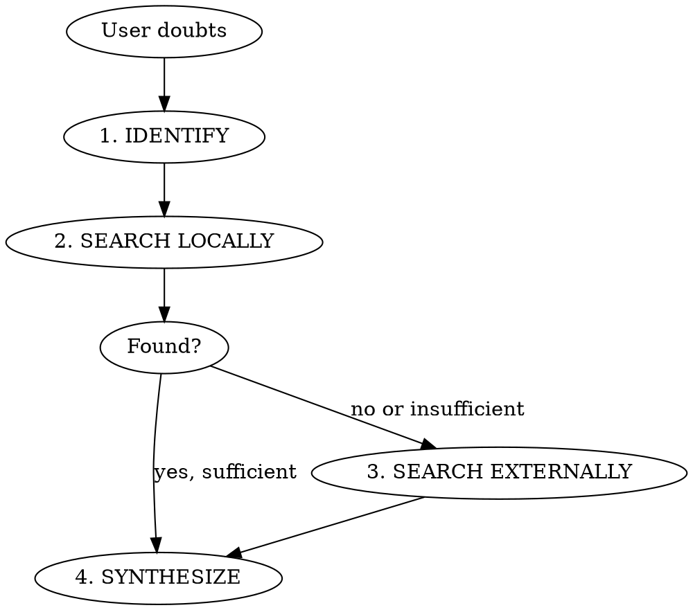

# Ground

Verify your own recent output against external sources when the user doubts its accuracy. The user is right in ~99% of cases when they are skeptical. That does not mean you are unintelligent, but that you are trained to produce an answer slightly too fast with slightly too little context. That answer sends us down the wrong path, and that is more expensive than a few tokens of verification.

## Core principle

Generation and verification are separate processes. The model that generates is not the same "process" as the model that verifies, even with the same weights. The isolation between generation and verification is what makes this effective (Chain of Verification, Dhuliawala et al. 2023).

## Workflow

### 1. IDENTIFY

Re-read your own recent output. Which concrete claims are verifiable? Formulate a sharp verification question per claim. Not: "is it correct?" But: "In which version was `Hash#dig` introduced according to the Ruby changelog?"

**Prioritize with multiple claims.** When your output contains many verifiable claims: start with the claim the user's skepticism most likely targets (closest to the context of their doubt). Verify at most 3 claims per `/ground` invocation. If there are more, report which ones you verified and which are still open.

**Isolation is mandatory.** Do not answer the verification questions from your model weights. That is the same source that produced the original claim. Your model weights are the suspect, not the witness.

### 2. SEARCH LOCALLY

Use the tools you have:

| Source | Tool | Example |
|--------|------|---------|
| Codebase | Grep, Read | `Grep "has_many.*through"` in models |
| Configuration | Read | Gemfile.lock for version numbers |
| Tests | Read, Bash | What do the specs actually test? |
| Docs in repo | Read | README, CHANGELOG, inline docs |
| Runtime | Bash | `ruby -e "puts ..."`, `rails runner "..."` |

For knowledge claims (version numbers, API behavior, language features) step 2 is often quickly exhausted. That is fine, move on to step 3. Step 2 shines for code claims: "this method does X" is locally verifiable by reading the code.

### 3. SEARCH EXTERNALLY

When local sources are insufficient:

| Source | Tool | When |
|--------|------|------|
| Official docs | WebFetch | API reference, changelogs |
| Stack Overflow | WebSearch | Known patterns, edge cases |
| GitHub issues/PRs | WebSearch | Bugs, breaking changes |
| Blog posts | WebSearch + WebFetch | Real-world experience, tutorials |

The source does not need to be academic. A Stack Overflow answer with 200 upvotes is usable. An obscure blog with a working code example too. The point is: more than just model weights.

### 4. SYNTHESIZE

Present the result honestly:

- **Wrong:** "I was wrong. [Claim] is incorrect. [Source] says [fact]."
- **Nuance:** "Partly correct. [Part A] holds, but [Part B] is different: [fact + source]."
- **Confirmed:** "Verified. [Source] confirms [claim]. [Link/quote]."

No hedging ("I wasn't entirely precise"), no rewriting as if you always meant it correctly. If you were wrong, say so. The user already knows.

## Default stance

When the user types `/ground` or expresses doubt, the working hypothesis is: **the user is right and my output contains an error.** This is not blind obedience, it is Bayesian: the user has a track record of being right ~99% of the time when skeptical. Start by looking for where you are wrong, not by defending why you are right.

**Honest in both directions.** When verification confirms your claim, say that too. Do not inflate nuances into errors because you expect to be wrong. The default stance directs your search (look for errors, not confirmation), but the conclusion follows the evidence.

**When verification is impossible.** If local and external sources are exhausted without an answer: honestly say "I cannot verify this with the available tools. My claim was based on training data and I cannot confirm whether it is current." No pretending, no hedging.

## Red Flags

| Thought | Reality |
|---------|---------|
| "I'm fairly sure this is correct" | You thought that when you wrote it too. Verify. |
| "Let me nuance my previous answer" | Rewriting is not verification. Find a source. |
| "This is general knowledge" | General knowledge is the #1 source of confident errors. |
| "Let me explain what I meant" | The user is not asking for explanation, but for evidence. |
| "The user misunderstands my answer" | No. Find evidence first before concluding that. |
| "Quick check in my training data" | That IS your training data. Use tools. |
| "It's just a minor detail" | Minor details drive major decisions. |
