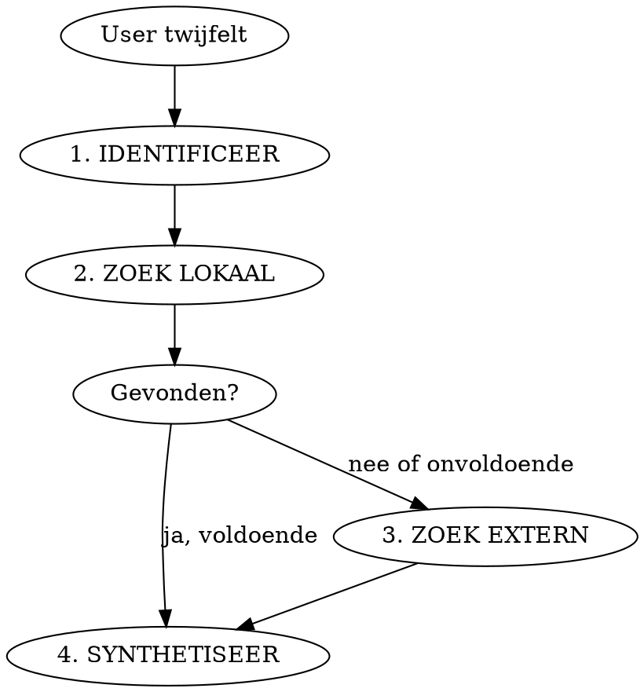

# Ground

Verifieer je eigen recente output met externe bronnen wanneer de user twijfelt aan de juistheid. De user heeft in ~99% van de gevallen gelijk wanneer die sceptisch is. Dat betekent niet dat je dom bent, maar dat je getraind bent om net iets te snel een antwoord te geven met net te weinig context. Dat antwoord stuurt ons het verkeerde pad in, en dat is duurder dan een paar tokens verificatie.

## Kernprincipe

Genereren en verifiëren zijn aparte processen. Het model dat genereert is niet hetzelfde "proces" als het model dat verifieert, zelfs met dezelfde weights. De isolatie tussen generatie en verificatie is wat dit effectief maakt (Chain of Verification, Dhuliawala et al. 2023).

## Workflow

### 1. IDENTIFICEER

Lees je eigen recente output opnieuw. Welke concrete claims zijn verifieerbaar? Formuleer per claim een scherpe verificatievraag. Niet: "klopt het?" Wel: "In welke versie is `Hash#dig` geïntroduceerd volgens de Ruby changelog?"

**Prioriteer bij meerdere claims.** Wanneer je output veel verifieerbare claims bevat: begin bij de claim waar de user's scepsis het meest waarschijnlijk op slaat (dichtst bij de context van hun twijfel). Verifieer maximaal 3 claims per `/ground` invocatie. Als er meer zijn, meld welke je hebt geverifieerd en welke nog open staan.

**Isolatie is verplicht.** Beantwoord de verificatievragen niet uit je modelgewichten. Dat is dezelfde bron die de oorspronkelijke claim produceerde. Je modelgewichten zijn de verdachte, niet de getuige.

### 2. ZOEK LOKAAL

Gebruik de tools die je hebt:

| Bron | Tool | Voorbeeld |
|------|------|-----------|
| Codebase | Grep, Read | `Grep "has_many.*through"` in models |
| Configuratie | Read | Gemfile.lock voor versienummers |
| Tests | Read, Bash | Wat testen de specs daadwerkelijk? |
| Docs in repo | Read | README, CHANGELOG, inline docs |
| Runtime | Bash | `ruby -e "puts ..."`, `rails runner "..."` |

Voor knowledge-claims (versienummers, API gedrag, taalfeatures) is stap 2 vaak snel uitgeput. Dat is prima, ga door naar stap 3. Stap 2 schittert bij code-claims: "deze method doet X" is lokaal verifieerbaar door de code te lezen.

### 3. ZOEK EXTERN

Wanneer lokale bronnen onvoldoende zijn:

| Bron | Tool | Wanneer |
|------|------|---------|
| Officiële docs | WebFetch | API referentie, changelogs |
| Stack Overflow | WebSearch | Bekende patronen, edge cases |
| GitHub issues/PRs | WebSearch | Bugs, breaking changes |
| Blog posts | WebSearch + WebFetch | Praktijkervaring, tutorials |

De bron hoeft niet academisch te zijn. Een Stack Overflow antwoord met 200 upvotes is bruikbaar. Een obscure blog met een werkend codevoorbeeld ook. Het punt is: meer dan alleen modelgewichten.

### 4. SYNTHETISEER

Presenteer het resultaat eerlijk:

- **Fout:** "Ik zat fout. [Claim] klopt niet. [Bron] zegt [feit]."
- **Nuance:** "Deels juist. [Deel A] klopt, maar [Deel B] zit anders: [feit + bron]."
- **Bevestigd:** "Geverifieerd. [Bron] bevestigt [claim]. [Link/citaat]."

Geen hedging ("ik was niet helemaal precies"), geen herschrijven alsof je het altijd al goed bedoelde. Als je fout zat, zeg dat. De user weet het al.

## Default houding

Wanneer de user `/ground` typt of twijfel uit, is de werkhypothese: **de user heeft gelijk en mijn output bevat een fout.** Dit is geen blinde gehoorzaamheid, het is Bayesiaans: de user heeft een track record van ~99% gelijk bij scepsis. Begin met zoeken naar waar je fout zit, niet met verdedigen waarom je gelijk hebt.

**Eerlijk in beide richtingen.** Wanneer verificatie je claim bevestigt, zeg dat ook. Blaas nuances niet op tot fouten omdat je verwacht fout te zitten. De default houding stuurt je zoekrichting (zoek naar fouten, niet naar bevestiging), maar de conclusie volgt het bewijs.

**Wanneer verificatie onmogelijk is.** Als lokale en externe bronnen uitgeput zijn zonder antwoord: zeg eerlijk "Ik kan dit niet verifiëren met de beschikbare tools. Mijn claim was gebaseerd op training data en ik kan niet bevestigen of die actueel is." Geen doen-alsof, geen hedging.

## Red Flags

| Gedachte | Werkelijkheid |
|----------|---------------|
| "Ik weet vrij zeker dat dit klopt" | Dat dacht je ook toen je het schreef. Verifieer. |
| "Ik nuanceer even mijn vorige antwoord" | Herschrijven is geen verificatie. Zoek een bron. |
| "Dit is algemene kennis" | Algemene kennis is de #1 bron van confident fouten. |
| "Laat me even uitleggen wat ik bedoelde" | De user vraagt niet om uitleg, maar om bewijs. |
| "De user begrijpt mijn antwoord verkeerd" | Nee. Zoek eerst bewijs voordat je dat concludeert. |
| "Even snel checken in mijn training data" | Dat IS je training data. Gebruik tools. |
| "Het is maar een klein detail" | Kleine details sturen grote beslissingen. |
