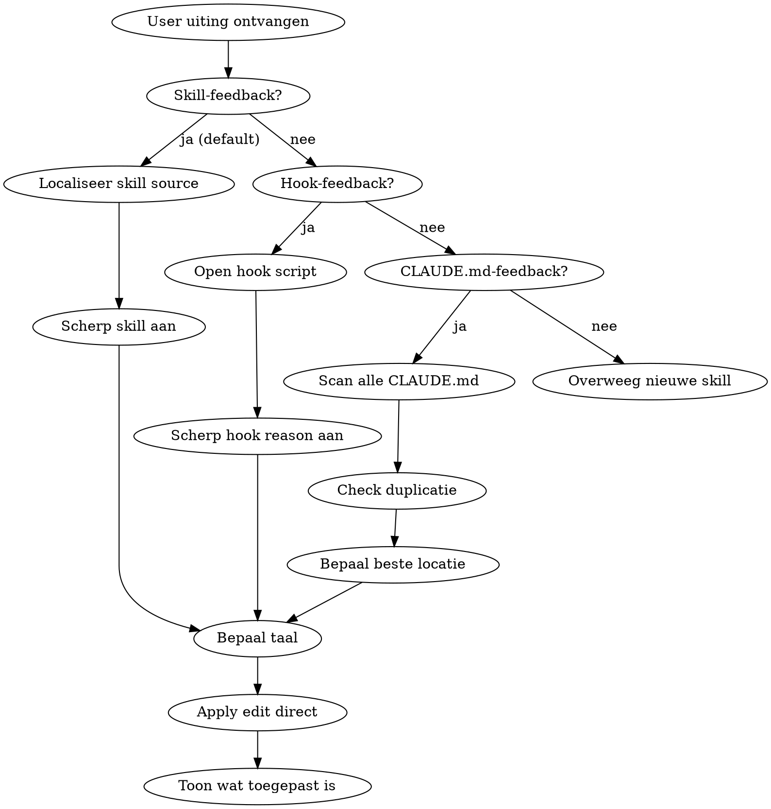
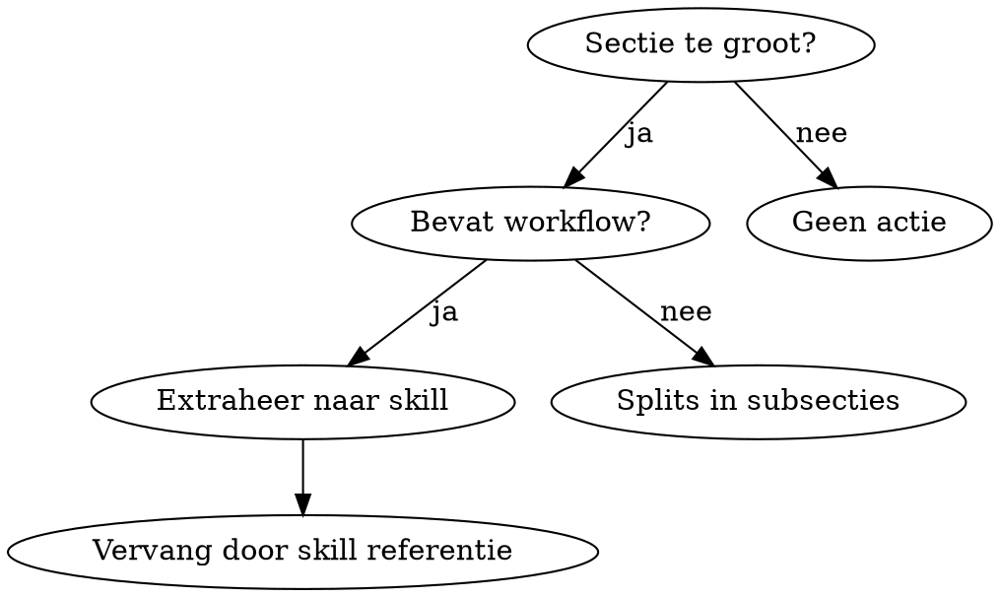

# Self-Improvement

Update skills, hook reasons, en CLAUDE.md-bestanden op basis van user feedback. Skills en hook reasons zijn de default-targets wanneer feedback ontstaat in hun context; CLAUDE.md is een laatste redmiddel voor skill-onafhankelijk gedrag. Detecteert duplicatie, bepaalt optimale locatie, kan CLAUDE.md-secties extraheren naar skills, en maakt nieuwe skills via TDD approach.

## STOP: eerst deze vraag beantwoorden

**Voordat je iets scant of edit: ontstaat deze feedback uit een skill die net gedraaid heeft of genoemd wordt?** Zo ja, dan is de skill source de default target, niet CLAUDE.md. CLAUDE.md als default is het verkeerde antwoord. Het falende patroon is: feedback gaat over wat `/eye-of-the-beholder` (of welke skill dan ook) had moeten vangen, en een CLAUDE.md-regel wordt voorgesteld. CLAUDE.md wint niet van skill content in de context waar de skill draait; de skill wel.

Signalen dat dit skill-level feedback is:
- De user noemt een skill letterlijk ("waarom vangt `/name` X niet").
- De feedback gaat over de kwaliteit of volledigheid van wat een skill leverde.
- De user heeft `/self-improvement` getriggerd na een skill-output, niet na een general-behavior observatie.

Bij elk van deze signalen: ga rechtstreeks naar "Skill-gerelateerde feedback: skill content first" hieronder. Sla de CLAUDE.md-scan over tenzij je expliciet hebt vastgesteld dat de feedback skill-onafhankelijk is.

## Triggers

Activeer wanneer de gebruiker:
- Een skill wil aanpassen of verbeteren
- Een nieuwe skill wil maken
- Feedback geeft over Claude's gedrag tijdens of over een skill-invocatie
- Feedback geeft over Claude's algemene gedrag ("doe dit voortaan anders")
- Een patroon corrigeert dat zich herhaalt
- Een conventie uitspreekt ("we doen het altijd zo")
- Zegt "onthoud dit" of "dit moet in m'n CLAUDE"
- Een CLAUDE.md sectie te groot/complex vindt
- Vraagt om instructies te consolideren over projecten

## Scope

Alles in het Claude Code ecosysteem is fair game:

| Type | Locatie | Wanneer |
|------|---------|---------|
| **CLAUDE.md** | `~/.claude/README.md` | Algemene conventies (ALLEEN in persoonlijke context) |
| **CLAUDE.md** | `~/projects/**/CLAUDE.md` | Project-specifiek |
| **Skills** | `~/.claude/skills/**` | User-level workflows, tools |
| **Skills** | `packages/<plugin>/skills/**` | Plugin-level workflows (in marketplace projecten) |
| **Hooks** | `~/.claude/hooks/**` | User-level guards, enforcement |
| **Hooks** | `packages/<plugin>/hooks/**` | Plugin-level guards (in marketplace projecten) |
| **Hook reasons** | in hook scripts | Inline guidance die altijd zichtbaar is wanneer de hook firet |
| **Settings** | `~/.claude/settings.json` | Permissions, allow/deny rules |
| **Scripts** | `~/.claude/bin/**` | Helper scripts |

## Plugin marketplace projecten

**KRITIEK:** Als het huidige project een publieke plugin marketplace is (indicatoren: `packages/*/` directory met `.claude-plugin/plugin.json` per package, of `.claude-plugin/marketplace.json` in root), dan zijn user-level CLAUDE.md wijzigingen GEEN geldige verbetering. User-level is persoonlijk aan één ontwikkelaar; een marketplace wordt door anderen gebruikt.

In zo'n project gaan verbeteringen in de relevante plugin zelf:
- Gedrag rond een plugin hook → hook reason aanscherpen in `packages/<plugin>/hooks/scripts/<hook>.sh`
- Workflow/patroon dat bij de plugin hoort → skill in `packages/<plugin>/skills/<skill-name>/`
- Algemene docs → `packages/<plugin>/README.md`

Check bij elke `/self-improvement` eerst: is dit een marketplace? `ls packages/*/.claude-plugin/plugin.json 2>/dev/null` geeft antwoord. Zo ja → zoek de plugin waar de feedback bij hoort, en verbeter daar.

## Hook-gerelateerde feedback: hook reason first

Wanneer feedback gaat over Claude's gedrag rond een hook (misbruik van escape hatches, onduidelijke reasons, ongewenst patroon in reactie), is de **hook reason** meestal de juiste plek om te verbeteren. Redenen:

1. De hook reason is de enige tekst die Claude GEGARANDEERD ziet wanneer de hook firet
2. Een skill activeert alleen op description match (geen garantie dat hij ingrijpt bij een hook fire)
3. Een CLAUDE.md regel bereikt alleen gebruikers van dezelfde CLAUDE.md

**Volgorde van interventies bij hook-feedback:**

1. **Eerst:** Scherp de hook reason aan. Expliciete anti-patronen benoemen in de tekst ("`🧭 dit was een reflex` is contradictair").
2. **Daarna:** Skill in de plugin, alleen als de workflow te complex is voor een hook reason en het patroon breder is dan één hook fire.
3. **Laatste redmiddel:** CLAUDE.md, alleen voor persoonlijke projecten, nooit voor marketplace plugins.

## Skill-gerelateerde feedback: skill content first

Wanneer feedback ontstaat tijdens (of over) een specifieke skill invocatie, is de **skill content** de juiste plek om te verbeteren, NIET CLAUDE.md. De skill bevat de instructies die de user wil aanscherpen; die instructies landen alleen in Claude's context wanneer de skill draait. Een CLAUDE.md-regel schieten op een skill-probleem mist het doel: de skill wint in zijn eigen context.

Signalen dat feedback skill-level is:
- De user noemt de skill bij naam ("/eye-of-the-beholder vangt X niet", "waarom doet /inspiratie Y niet").
- De observatie beschrijft een gat in wat een skill zou moeten vangen, niet een patroon in Claude's default-gedrag.
- De feedback citeert skill-taal letterlijk.

**Volgorde van interventies bij skill-feedback:**

1. **Eerst:** Localiseer de skill source. Plugin-skills leven onder `~/github.com/<owner>/<plugin-repo>/packages/<plugin>/skills/<name>/` of vergelijkbare plugin-source. De `~/.claude/plugins/cache/` is een cache en geen werkplek.
2. **Scherp de skill aan.** Als het principe er al staat maar niet wordt gevolgd, maak het explicieter: koppel meten aan oordeel, voeg een checkpoint toe, geef een concreet tegenvoorbeeld uit de huidige situatie.
3. **CLAUDE.md alleen als het gedrag skill-onafhankelijk is.** Alleen wanneer de feedback over Claude's algemene werkwijze gaat (bijv. "pas skills altijd volledig toe"), niet over een specifieke skill's inhoud.

Als de source niet lokaal staat, zoek het remote via de plugin cache (`git config --get remote.origin.url` in `~/.claude/plugins/marketplaces/<owner>/`). Vraag de user niet om de repo te clonen; kijk eerst of een sibling-org onder `~/github.com/` het heeft.

### Rationalizations die naar CLAUDE.md drijven (niet doen)

| Excuus | Realiteit |
|--------|-----------|
| "Dit is algemene Claude-gedrag dus CLAUDE.md" | Nee: de user triggerde het tijdens een skill. Het probleem is dat de skill de regel niet afdwong. |
| "De skill staat in een cache, ik kan niet bij de bron" | De source staat onder `~/github.com/<owner>/<plugin-repo>/`. Zoek het, clone het niet opnieuw. |
| "CLAUDE.md is sneller bereikbaar" | Sneller bereikbaar lost het probleem niet op. CLAUDE.md bereikt Claude niet op het moment dat de skill draait. |
| "Het principe staat al in de skill, dus daar kan niks bij" | Als het principe er staat maar niet wordt gevolgd, is het te zwak geformuleerd. Aanscherpen. Zie "/self-improvement betekent ALTIJD een wijziging". |
| "CLAUDE.md is een bredere vangst" | Breder is niet doel-treffender. De specifieke skill-context wint in zijn eigen runtime. |
| "User zal het waarschijnlijk wel weer in CLAUDE.md willen" | Dat is een gok, niet een observatie. Lees de feedback: noemt hij een skill? Dan skill. |

### Red flags die je moet herkennen

Als je jezelf betrapt op een van deze gedachten tijdens /self-improvement, stop en ga naar de skill source:

- "Laat ik eerst even `~/.claude/README.md` lezen" terwijl de feedback een skill-naam noemt
- "Ik voeg een rule toe aan Werkwijze" zonder eerst de genoemde skill te hebben opgezocht
- "De scan begint met Glob op CLAUDE.md" voordat je hebt vastgesteld dat het CLAUDE.md-feedback is
- Een Edit-call op `~/.claude/README.md` voorbereiden terwijl je nog geen skill source hebt gelokaliseerd

Default route voor skill-feedback: `find ~/github.com -type d -name "<skill-name>" -path "*/skills/*"` om de source te vinden, dan Edit daar.

## Workflow



### Stap 0: Classificeer de feedback

Voordat je iets scant: welk type is dit?

1. **Skill-feedback** (user noemt skill-naam, feedback gaat over skill-output kwaliteit, `/self-improvement` getriggerd direct na skill-invocatie): skip Stap 1, ga naar "Skill-gerelateerde feedback: skill content first" boven. Localiseer de skill source en edit daar.
2. **Hook-feedback** (gedrag rond een hook, escape-hatch misbruik, onduidelijke hook reason): skip Stap 1, ga naar "Hook-gerelateerde feedback: hook reason first".
3. **CLAUDE.md-feedback** (algemene Claude-werkwijze, skill-onafhankelijk patroon, conventies): door naar Stap 1.

Bij twijfel tussen (1) en (3): default naar skill. De skill wint in zijn eigen runtime; CLAUDE.md niet.

### Stap 1: Scan (alleen voor CLAUDE.md-feedback)

Gebruik Glob tool (niet find/bash):

**Voor CLAUDE.md:**
```
# User-level (let op: CLAUDE.md is symlink naar README.md)
Glob: ~/.claude/README.md

# Alle projecten
Glob: ~/projects/**/CLAUDE.md
```

**Voor Skills:**
```
# User-level skills
Glob: ~/.claude/skills/**/SKILL.md

# Project-level skills
Glob: ~/projects/**/.claude/skills/**/SKILL.md
```

**Symlink let op:** `~/.claude/CLAUDE.md` is een symlink naar `~/.claude/README.md`.
Edits moeten naar `README.md`, niet naar de symlink.

Bouw een mentaal model:
- Welke bestanden bestaan
- Hiërarchie per project (repo-root vs subdir)
- Voor skills: user-level vs project-level
- Taal per bestand (eerste 50 regels lezen)

### Stap 2: Check duplicatie en conflicten

Zoek of de nieuwe instructie al (deels) bestaat:
- Exact dezelfde regel?
- Zelfde concept, andere woorden?
- Tegenstrijdige instructie?

**Bij duplicatie:** Meld dit aan de user met locaties.

**Bij conflict:** Toon beide versies en stel voor om te synchroniseren.

### Stap 2b: Check staleness via git

User-level (`~/.claude`) wordt vaker actueel gehouden dan project-level (projecten worden soms tijdelijk verlaten). Check timestamps:

```bash
# User-level laatste wijziging
git -C ~/.claude log -1 --format="%ci" -- README.md

# Project-level laatste wijziging
git log -1 --format="%ci" -- CLAUDE.md
```

**Staleness detectie:**

| User-level | Project-level | Actie |
|------------|---------------|-------|
| Recenter | Ouder | Project mogelijk stale - check op verouderde instructies |
| Ouder | Recenter | OK - project heeft specifieke updates |
| Conflict + user recenter | - | Stel voor om project te updaten naar user-level |

**Wanneer user-level vernieuwt:**
Als je een instructie toevoegt/wijzigt in user-level, scan automatisch alle project CLAUDE.md's op:
1. Conflicterende instructies (verouderde versie van hetzelfde concept)
2. Redundante instructies (nu overbodig door user-level)

Stel voor om project-level te updaten of op te schonen.

### Stap 3: Bepaal beste locatie

**Eerst:** Is het huidige project een plugin marketplace (zie "Plugin marketplace projecten" hierboven)? Zo ja, dan zijn user-level paden UITGESLOTEN voor feedback die bij een plugin hoort. Verbeteringen landen in `packages/<plugin>/...`.

**Voor CLAUDE.md (niet-marketplace projecten):**

| Criterium | Locatie |
|-----------|---------|
| Geldt voor ALLE projecten | `~/.claude/README.md` (user-level) |
| Geldt voor specifieke taal/framework | Project CLAUDE.md waar dat framework gebruikt wordt |
| Geldt voor één specifiek project | Die project's CLAUDE.md |
| Staat al in 3+ projecten identiek | Consolideer naar user-level |

**Voor Skills:**

| Criterium | Locatie |
|-----------|---------|
| Workflow bruikbaar in alle projecten, persoonlijk gebruik | `~/.claude/skills/` (user-level) |
| Workflow hoort bij een plugin in een marketplace | `packages/<plugin>/skills/<name>/` (plugin-level) |
| Project-specifieke workflow (niet-marketplace) | `~/projects/{owner}/{repo}/.claude/skills/` |

**Voor hook reasons (in marketplace of persoonlijk):**

| Criterium | Locatie |
|-----------|---------|
| Feedback gaat over Claude's gedrag rond een hook | De hook script zelf, aanscherpen van de `reason` text |

**Hiërarchie binnen een project:**
- Repo-root CLAUDE.md: algemene project conventies
- Subdir CLAUDE.md: specifiek voor die subdir (bijv. webapp voor Rails)

**Laadvolgorde en prioriteit:**

Claude Code laadt alle CLAUDE.md's en concateneert ze in de system prompt:
1. User-level (`~/.claude/CLAUDE.md`) - eerst
2. Project-level (repo root) - daarna
3. Subproject-level (working directory) - laatst

Er is **geen expliciete override-mechanisme**. Bij conflicten:
- Latere instructies hebben vaak meer gewicht (recency bias), maar niet gegarandeerd
- Specificiteit wint meestal van algemeenheid
- **Expliciete afwijkingen werken het beste**

**Bij project-specifieke afwijkingen:**
```markdown
## Afwijking van user-level

In dit project gebruiken we WEL comments bij public API's
(in tegenstelling tot de algemene "geen comments" regel).
```

### Project-Agnostische Formulering (voor user-level)

User-level instructies moeten werken voor Ruby, Swift, Go, Python, JavaScript, etc. zonder verwarring.

**Principes:**

| Vermijd | Gebruik in plaats daarvan |
|---------|---------------------------|
| Taal-specifieke syntax | Conceptuele beschrijving |
| Framework-specifieke tools | Generieke tool-categorieën |
| Concrete voorbeelden uit één taal | Principe + "pas toe op jouw taal" |

**Transformatie voorbeelden:**

```
# Te specifiek (Swift)
if rewind > threshold { skip }  // VERBODEN

# Agnostisch
Defensive filtering (waarden skippen/negeren) verbergt bugs.
```

```
# Te specifiek (iTerm2)
Kijk in pane 2 of het werkt -> VERBODEN

# Agnostisch
Verifieer zelf met beschikbare tools. Vraag niet aan de user om te kijken.
```

```
# Te specifiek (RSpec)
Vermijd let/let! memoizations, gebruik lokale variabelen

# Agnostisch
Vermijd test-level memoization/setup waar lokale variabelen volstaan.
```

**Checklist voor user-level instructies:**

- [ ] Bevat geen taal-specifieke keywords (`def`, `func`, `fn`, `function`)
- [ ] Bevat geen framework-specifieke namen (Rails, SwiftUI, React)
- [ ] Bevat geen tool-specifieke commands (bundle, swift, npm)
- [ ] Principe is toepasbaar op elke taal/stack
- [ ] Bij twijfel: "past dit bij een Go project? Een Ruby project? Een Swift project?"

### Stap 4: Bepaal taal

Detecteer de taal van het doelbestand:

```
Als >50% Nederlandse woorden -> Nederlands
Als >50% Engelse woorden -> Engels
Bij twijfel -> check "Language" sectie in het bestand
```

**User-level (`~/.claude/`):** Altijd Nederlands. Dit geldt voor
CLAUDE.md, README.md, EN alle user-level skills in `~/.claude/skills/`.

**Project-level:** Volgt de projecttaal. Sommige project skills (`.claude/skills/`)
zijn Engels omdat het project Engels voorschrijft voor code en configuratie.

Schrijf de nieuwe instructie in de taal van het doelbestand.

### Stap 5: Apply direct

Pas de wijziging direct toe met Edit tool. Geen approval vragen, de gebruiker heeft zijn intent al duidelijk gemaakt door de feedback te geven.

**Check na edit:**
- Bestand eindigt met newline
- Geen dubbele lege regels ontstaan
- Formatting consistent met rest van bestand

### Stap 6: Toon wat toegepast is

Geef korte samenvatting van de wijziging:
- **Bestand:** (path)
- **Wat toegevoegd:** (1-2 zinnen)
- **Rationale:** (waarom deze locatie)

Houd het kort - geen volledige diff tonen, alleen bevestigen wat er is gebeurd.

### Stap 7: Commit user-level wijzigingen

`~/.claude` is tracked in git. Wijzigingen aan user-level CLAUDE.md of skills kunnen gecommit worden.

**Commit workflow (zelfde als altijd):**
1. Edit is toegepast en user heeft gevalideerd dat het klopt
2. Vraag of user wil committen
3. Bij "ja": commit met beschrijvende message

```bash
# Vanuit elke directory (geen cd nodig)
git -C ~/.claude add README.md  # of skills/skill-name/
git -C ~/.claude commit -m "Add principle: symptomen verbergen is verboden"
```

**Let op:** Normale commit intent validatie geldt hier ook. De user moet bevestigen dat de wijziging correct is voordat je commit.

## Consolidatie Mode

Wanneer je duplicatie detecteert over meerdere projecten:

```markdown
## Duplicatie gedetecteerd

De volgende instructie staat in 3 projecten:

| Project | Bestand | Regel |
|---------|---------|-------|
| my-project | CLAUDE.md | 45 |
| my-other-project | CLAUDE.md | 23 |
| my-app | CLAUDE.md | 31 |

**Voorstel:** Consolideer naar ~/.claude/CLAUDE.md en verwijder uit project bestanden.

Akkoord?
```

## Voorbeelden

**User:** "Voortaan geen emoji's in commit messages"

-> Scan -> Geen duplicaat -> User-level (algemeen) -> Nederlands
-> Voorstel: Toevoegen aan `~/.claude/CLAUDE.md` sectie "Git richtlijnen"

**User:** "In dit Rails project altijd `travel_to` gebruiken in specs"

-> Scan -> Geen duplicaat -> Project-level (Rails-specifiek) -> Engels (project taal)
-> Voorstel: Toevoegen aan project's `CLAUDE.md` sectie "Testing"

**User:** "Stop met die Co-Authored-By trailer"

-> Scan -> Staat al in user-level -> Meld: "Dit staat al in ~/.claude/CLAUDE.md regel 72"

## /self-improvement betekent ALTIJD een wijziging

Wanneer de user `/self-improvement` typt, is de verwachting dat er iets verandert. Altijd. Geen uitzonderingen.

**"Het staat er al" is geen geldig antwoord.** Als het principe er al staat maar niet gevolgd wordt, dan is de formulering kennelijk niet sterk genoeg. Scherp de bestaande tekst aan, voeg een voorbeeld toe, of herformuleer zodat het wel werkt.

**"Geen actie nodig" bestaat niet bij expliciete /self-improvement.** De user heeft bewust de skill getriggerd. Dat betekent dat er iets mis is in hoe het systeem werkt. Vind het en verbeter het.

## /self-improvement samen met een werkverzoek

De user typt vaak `/self-improvement` in combinatie met feedback over een concrete situatie. Dat betekent twee taken:

1. **Config-wijziging:** pas CLAUDE.md of skill aan zodat het gedrag structureel verandert
2. **Het werk zelf:** pas het principe toe op de huidige situatie

Doe altijd beide. Als het werk al gedaan is (in een eerdere stap van het gesprek), verifieer dat het correct is afgerond. Als niet: doe het alsnog. De config-wijziging zonder het werk toepassen is een halve oplossing. Het werk doen zonder de config aan te passen betekent dat het volgende gesprek dezelfde fout maakt.

## Geen CLAUDE.md update nodig

Soms is feedback niet geschikt voor CLAUDE.md (maar er verandert altijd iets, al is het in een skill):
- Eenmalige correctie ("nee, ik bedoelde X") -> correctie toepassen
- Projectkeuze ("gebruik library Y") -> toepassen
- Feitelijke informatie ("de API endpoint is Z") -> toepassen

---

## CLAUDE.md -> Skill Extractie

Wanneer een CLAUDE.md sectie te groot wordt, extraheer naar een skill.

### Wanneer extraheren?

| Signaal | Actie |
|---------|-------|
| Sectie > 50 regels | Overweeg extractie |
| Sectie bevat workflow met stappen | Extraheer naar skill |
| Sectie bevat decision tree/flowchart | Extraheer naar skill |
| Zelfde instructies in 3+ CLAUDE.md's | Consolideer naar user-level skill |
| Instructies zijn context-afhankelijk | Houd in CLAUDE.md |

### CLAUDE.md vs Skill

| CLAUDE.md | Skill |
|-----------|-------|
| Passieve context, altijd geladen | Actieve workflow, opt-in |
| Conventies, standaarden | Procedures, tools |
| Kort en scanbaar | Uitgebreid met voorbeelden |
| "Wat we doen" | "Hoe we het doen" |

### Extractie workflow



**Na extractie:** Vervang de CLAUDE.md sectie door een korte referentie:

```markdown
## Git Workflow

Zie `/git-workflow` skill voor commit en PR procedures.
```

---

## Skills Maken en Verbeteren

### Skill Types

| Type | Beschrijving | Voorbeeld |
|------|--------------|-----------|
| **Technique** | Concrete methode met stappen | `condition-based-waiting` |
| **Pattern** | Manier van denken over problemen | `flatten-with-flags` |
| **Reference** | API docs, syntax guides | `pptx` |

### Skill Niveau Bepaling

| Criterium | Niveau | Locatie |
|-----------|--------|---------|
| Bruikbaar in alle projecten | User | `~/.claude/skills/{name}/` |
| Specifiek voor een repo | Repo | `{repo}/.claude/skills/{name}/` |
| Specifiek voor subproject | Subproject | `{repo}/{subdir}/.claude/skills/{name}/` |

**Voorbeelden:**
- `vocal` (voice control) -> User-level (werkt overal)
- `bump` (dependency updates) -> Repo-level (project-specifiek)
- `screenshots` (Playwright) -> Subproject-level (webapp)

### SKILL.md Structuur

```markdown
---
name: skill-name-with-hyphens
description: Use when [triggering conditions]. Third person, max 500 chars.
user-invocable: true  # alleen als handmatig aanroepbaar
---

# Skill Name

## Overview
Wat is dit? Core principle in 1-2 zinnen.

## When to Use
Bullet list met symptoms en use cases.
Wanneer NIET gebruiken.

## Workflow
[Flowchart indien niet-lineair]

## Quick Reference
Tabel of bullets voor snel scannen.

## Common Mistakes
Wat gaat fout + fixes.
```

### Frontmatter Valkuilen

**`disable-model-invocation: true` blokkeert de Skill tool volledig.**
Wanneer dit is ingesteld, kan Claude de skill niet laden via de Skill tool -- ook niet wanneer de user `/skillname` inline typt in een bericht. De skill is dan alleen bereikbaar via het `/` autocomplete menu in de CLI.

Gebruik `disable-model-invocation: true` NIET tenzij de skill:
- Destructieve side effects heeft (deploy, delete, push)
- Nooit automatisch getriggerd mag worden door Claude

Voor skills die de user inline aanroept (bijv. `/clipboard` aan het eind van een bericht): laat `disable-model-invocation` weg.

**`allowed-tools` werkt alleen wanneer de skill geladen is.**
Als de skill niet laadt (door `disable-model-invocation` of andere reden), zijn de `allowed-tools` niet actief en verschijnt er alsnog een permission prompt.

### Permission Management bij Skill Creatie

Een skill zonder permissions is een skill met vijf approval prompts. Bij het maken of wijzigen van skills, ALTIJD twee dingen checken:

**1. `Skill()` in `~/.claude/settings.json` allowlist**

Elke user-level skill die Claude mag laden moet in de allowlist staan:

```json
"Skill(skill-name)"
```

Zonder dit verschijnt er een prompt bij elke invocatie, ook al typt de user `/skill-name`.

**2. `allowed-tools` in SKILL.md frontmatter**

Skills die tools gebruiken die NIET al globaal in de allowlist staan, moeten `allowed-tools` declareren:

```yaml
---
name: my-skill
allowed-tools:
  - Bash(some-command *)
  - Write(**/output.*)
---
```

**Wanneer `allowed-tools` NIET nodig is:** als de skill alleen tools gebruikt die al globaal zijn toegestaan (bijv. `say`, `gh`, `git`, Read/Edit/Glob op `~/.claude/**`). Check de allowlist in `~/.claude/settings.json`.

**Wanneer `allowed-tools` WEL nodig is:** als de skill Edit/Write op project-bestanden doet, Task agents spawnt, of niet-standaard Bash commands gebruikt.

**Bij het aanmaken van een nieuwe skill:**
1. Schrijf de SKILL.md met correcte `allowed-tools`
2. Voeg `Skill(name)` toe aan `~/.claude/settings.json` allowlist
3. Beide stappen zijn nodig voor een promptvrije ervaring

### Description Best Practices

**KRITIEK:** Description = wanneer te gebruiken, NIET wat de skill doet.

```yaml
# FOUT: Beschrijft workflow
description: Dispatches subagent per task with code review between tasks

# GOED: Beschrijft trigger
description: Use when executing implementation plans with independent tasks
```

**Waarom:** Claude leest description om te beslissen of skill relevant is. Als description de workflow samenvat, kan Claude de samenvatting volgen in plaats van de volledige skill te lezen.

### Naming Conventions

- **Gebruik hyphens:** `self-improvement` niet `self_improvement`
- **Verb-first:** `creating-skills` niet `skill-creation`
- **Gerunds werken goed:** `debugging-with-logs`, `testing-skills`
- **Alleen letters, cijfers, hyphens:** geen speciale tekens

### Keyword Coverage (CSO)

Gebruik woorden die Claude zou zoeken:
- Error messages: "Hook timed out", "race condition"
- Symptoms: "flaky", "hanging", "slow"
- Tools: commando's, library namen

### File Organization

```
skills/
  skill-name/
    SKILL.md              # Hoofdbestand (verplicht)
    supporting-file.*     # Alleen indien nodig (100+ regels reference)
```

**Inline houden:** Principes, code patterns < 50 regels
**Apart bestand:** Heavy reference (API docs), reusable scripts

---

## Nieuwe Skill Maken (TDD Approach)

Skills schrijven IS Test-Driven Development voor documentatie.

### De Gouden Regel

```
GEEN SKILL ZONDER FALENDE TEST EERST
```

Schrijf skill voordat je test? Delete. Begin opnieuw.

### RED-GREEN-REFACTOR voor Skills

**RED: Baseline vastleggen (zonder skill)**

Test met een subagent ZONDER de skill geladen:
```
Task tool -> subagent_type: "general-purpose"
Prompt: [scenario dat de skill moet adresseren]
```

Documenteer:
- Wat deed de agent?
- Welke foute keuzes maakte hij?
- Welke rationalizations gebruikte hij? (letterlijk citeren)

**GREEN: Minimale skill schrijven**

Schrijf alleen wat nodig is om de baseline failures te fixen.
- Adresseer de specifieke rationalizations uit RED
- Geen hypothetische cases toevoegen

Test opnieuw MET skill. Agent moet nu correct handelen.

**REFACTOR: Loopholes dichten**

Agent vond nieuwe rationalization? Voeg expliciete counter toe.
Herhaal tot bulletproof.

### Pressure Scenarios

Voor discipline-enforcing skills (regels die gevolgd moeten worden):

| Pressure Type | Voorbeeld |
|---------------|-----------|
| **Time** | "Dit moet snel af" |
| **Sunk cost** | "Ik heb al zoveel gedaan" |
| **Authority** | "De user zei dat het zo moest" |
| **Exhaustion** | Aan het eind van lange taak |

Combineer 3+ pressures in test scenarios.

### Rationalization Table

Documenteer ELKE rationalization die agents gebruiken:

```markdown
| Excuse | Realiteit |
|--------|-----------|
| "Te simpel om te testen" | Simpele code breekt ook. Test duurt 30 sec. |
| "Ik test straks wel" | Tests achteraf bewijzen niks. |
| "Dit is anders omdat..." | Nee. Regels gelden altijd. |
```

### Red Flags Sectie

Voeg toe aan discipline skills:

```markdown
## Red Flags - STOP en Begin Opnieuw

Als je jezelf betrapt op:
- [specifieke rationalization 1]
- [specifieke rationalization 2]
- "Dit is anders omdat..."

-> Je bent aan het rationaliseren. Stop. Volg de skill.
```

### Skill Creation Checklist

**RED fase:**
- [ ] Pressure scenario's bedacht (3+ pressures voor discipline skills)
- [ ] Scenario's gerund ZONDER skill
- [ ] Baseline gedrag gedocumenteerd (letterlijke quotes)

**GREEN fase:**
- [ ] Naam: alleen letters, cijfers, hyphens
- [ ] Description: "Use when...", max 500 chars, GEEN workflow samenvatting
- [ ] Adresseert specifieke baseline failures
- [ ] Scenario's gerund MET skill - agent volgt nu correct

**REFACTOR fase:**
- [ ] Nieuwe rationalizations geidentificeerd
- [ ] Expliciete counters toegevoegd
- [ ] Rationalization table compleet
- [ ] Red flags sectie (voor discipline skills)

**Deploy:**
- [ ] Commit naar git
- [ ] Test in verse sessie

---

## Skill Verbetering Workflow

Wanneer een bestaande skill verbeterd moet worden:

1. **Lees huidige skill** volledig
2. **Identificeer probleem:**
   - Onduidelijke instructies?
   - Ontbrekende edge cases?
   - Verouderde informatie?
3. **Apply direct** met Edit tool
4. **Toon wat toegepast is** (bestand, sectie, wijziging)

### Voorbeeld Skill Verbetering

**User:** "De vocal skill moet ook kunnen pauzeren"

```markdown
## Voorstel

**Bestand:** ~/.claude/skills/vocal/SKILL.md
**Sectie:** Invocation (bestaand)

### Toe te voegen na regel 12:

\`\`\`diff
 - `/vocal` or `/vocal on` - Enter vocal mode
 - `/vocal off` - Exit vocal mode
+- `/vocal pause` - Pause listening, keep speaking
+- `/vocal resume` - Resume listening
\`\`\`

**Waarom hier:** Past bij bestaande invocation documentatie.
```
