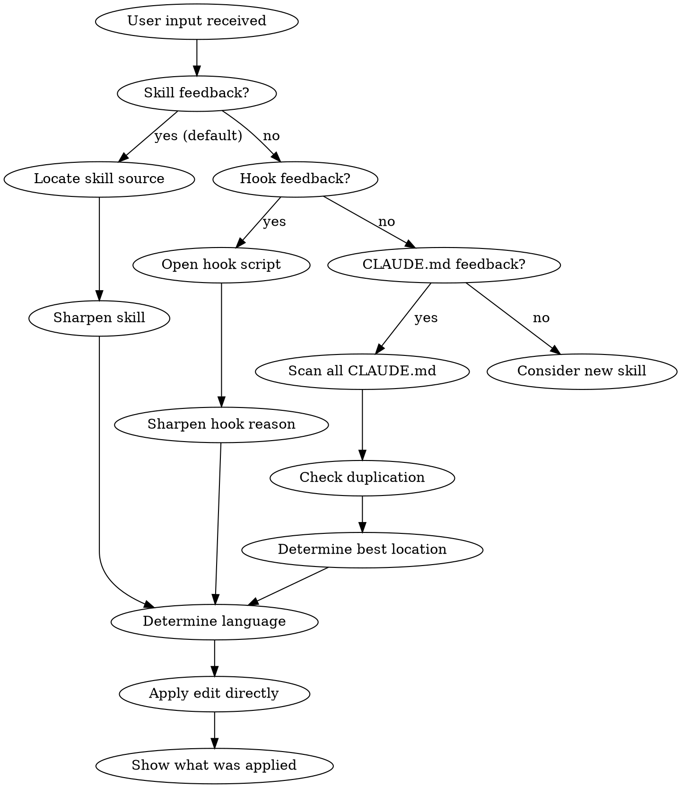
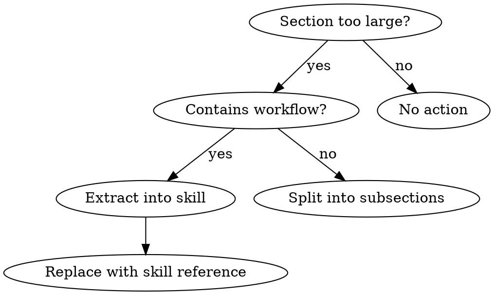

# Self-Improvement

Update skills, hook reasons, and CLAUDE.md files based on user feedback. Skills and hook reasons are the default targets when feedback arises in their context; CLAUDE.md is a last resort for skill-independent behavior. Detects duplication, determines optimal location, can extract CLAUDE.md sections to skills, and creates new skills via TDD approach.

## STOP: answer this question first

**Before you scan or edit anything: does this feedback arise from a skill that just ran or is being mentioned?** If so, the skill source is the default target, not CLAUDE.md. CLAUDE.md as default is the wrong answer. The failing pattern is: feedback is about what `/eye-of-the-beholder` (or any other skill) should have caught, and a CLAUDE.md rule gets proposed. CLAUDE.md does not win over skill content in the context where the skill runs; the skill does.

Signals that this is skill-level feedback:
- The user mentions a skill literally ("waarom vangt `/name` X niet").
- The feedback concerns the quality or completeness of what a skill delivered.
- The user triggered `/self-improvement` after a skill output, not after a general-behavior observation.

On any of these signals: go directly to "Skill-related feedback: skill content first" below. Skip the CLAUDE.md scan unless you have explicitly determined that the feedback is skill-independent.

## Triggers

Activate when the user:
- Wants to adjust or improve a skill
- Wants to create a new skill
- Gives feedback about Claude's behavior during or about a skill invocation
- Gives feedback about Claude's general behavior ("doe dit voortaan anders")
- Corrects a pattern that recurs
- States a convention ("we doen het altijd zo")
- Says "onthoud dit" or "dit moet in m'n CLAUDE"
- Finds a CLAUDE.md section too large/complex
- Asks to consolidate instructions across projects

## Scope

Everything in the Claude Code ecosystem is fair game:

| Type | Location | When |
|------|----------|------|
| **CLAUDE.md** | `~/.claude/README.md` | General conventions (ONLY in personal context) |
| **CLAUDE.md** | `~/projects/**/CLAUDE.md` | Project-specific |
| **Skills** | `~/.claude/skills/**` | User-level workflows, tools |
| **Skills** | `packages/<plugin>/skills/**` | Plugin-level workflows (in marketplace projects) |
| **Hooks** | `~/.claude/hooks/**` | User-level guards, enforcement |
| **Hooks** | `packages/<plugin>/hooks/**` | Plugin-level guards (in marketplace projects) |
| **Hook reasons** | in hook scripts | Inline guidance always visible when the hook fires |
| **Settings** | `~/.claude/settings.json` | Permissions, allow/deny rules |
| **Scripts** | `~/.claude/bin/**` | Helper scripts |

## Plugin marketplace projects

**CRITICAL:** If the current project is a public plugin marketplace (indicators: `packages/*/` directory with `.claude-plugin/plugin.json` per package, or `.claude-plugin/marketplace.json` in root), then user-level CLAUDE.md changes are NOT a valid improvement. User-level is personal to one developer; a marketplace is used by others.

In such a project, improvements go into the relevant plugin itself:
- Behavior around a plugin hook, sharpen the hook reason in `packages/<plugin>/hooks/scripts/<hook>.sh`
- Workflow/pattern that belongs to the plugin, skill in `packages/<plugin>/skills/<skill-name>/`
- General docs, `packages/<plugin>/README.md`

On every `/self-improvement`, check first: is this a marketplace? `ls packages/*/.claude-plugin/plugin.json 2>/dev/null` answers the question. If yes, find the plugin the feedback belongs to and improve there.

## Hook-related feedback: hook reason first

When feedback concerns Claude's behavior around a hook (misuse of escape hatches, unclear reasons, undesired pattern in response), the **hook reason** is usually the right place to improve. Reasons:

1. The hook reason is the only text Claude is GUARANTEED to see when the hook fires
2. A skill activates only on description match (no guarantee that it intervenes on a hook fire)
3. A CLAUDE.md rule only reaches users of the same CLAUDE.md

**Order of interventions for hook feedback:**

1. **First:** Sharpen the hook reason. Name explicit anti-patterns in the text ("`🧭 dit was een reflex` is contradictory").
2. **Next:** Skill in the plugin, only if the workflow is too complex for a hook reason and the pattern is broader than one hook fire.
3. **Last resort:** CLAUDE.md, only for personal projects, never for marketplace plugins.

## Skill-related feedback: skill content first

When feedback arises during (or about) a specific skill invocation, the **skill content** is the right place to improve, NOT CLAUDE.md. The skill contains the instructions the user wants to sharpen; those instructions only land in Claude's context when the skill runs. Firing a CLAUDE.md rule at a skill problem misses the target: the skill wins in its own context.

Signals that feedback is skill-level:
- The user names the skill ("/eye-of-the-beholder vangt X niet", "waarom doet /inspiratie Y niet").
- The observation describes a gap in what a skill should catch, not a pattern in Claude's default behavior.
- The feedback quotes skill language verbatim.

**Order of interventions for skill feedback:**

1. **First:** Locate the skill source. Plugin skills live under `~/github.com/<owner>/<plugin-repo>/packages/<plugin>/skills/<name>/` or comparable plugin source. The `~/.claude/plugins/cache/` is a cache and not a workplace.
2. **Sharpen the skill.** If the principle is already there but is not being followed, make it more explicit: tie measurement to judgment, add a checkpoint, give a concrete counter-example from the current situation.
3. **CLAUDE.md only when the behavior is skill-independent.** Only when the feedback concerns Claude's general working style (e.g., "always apply skills fully" / "pas skills altijd volledig toe"), not the content of a specific skill.

If the source is not local, find it remotely via the plugin cache (`git config --get remote.origin.url` in `~/.claude/plugins/marketplaces/<owner>/`). Do not ask the user to clone the repo; first check whether a sibling org under `~/github.com/` has it.

### Rationalizations that drift toward CLAUDE.md (do not do)

| Excuse | Reality |
|--------|---------|
| "This is general Claude behavior so CLAUDE.md" / "Dit is algemene Claude-gedrag dus CLAUDE.md" | No: the user triggered it during a skill. The problem is that the skill did not enforce the rule. |
| "The skill is in a cache, I cannot reach the source" / "De skill staat in een cache, ik kan niet bij de bron" | The source is under `~/github.com/<owner>/<plugin-repo>/`. Find it, do not re-clone. |
| "CLAUDE.md is faster to reach" / "CLAUDE.md is sneller bereikbaar" | Faster to reach does not solve the problem. CLAUDE.md does not reach Claude at the moment the skill runs. |
| "The principle is already in the skill, so nothing can be added there" / "Het principe staat al in de skill, dus daar kan niks bij" | If the principle is there but is not being followed, it is too weakly worded. Sharpen it. See "/self-improvement ALWAYS means a change". |
| "CLAUDE.md is a broader catch" / "CLAUDE.md is een bredere vangst" | Broader is not more on-target. The specific skill context wins in its own runtime. |
| "The user will probably want it in CLAUDE.md again" / "User zal het waarschijnlijk wel weer in CLAUDE.md willen" | That is a guess, not an observation. Read the feedback: does it name a skill? Then skill. |

### Red flags to recognize

If you catch yourself on one of these thoughts during /self-improvement, stop and go to the skill source:

- "Let me first read `~/.claude/README.md`" / "Laat ik eerst even `~/.claude/README.md` lezen" while the feedback names a skill
- "I will add a rule to Werkwijze" / "Ik voeg een rule toe aan Werkwijze" without first having looked up the named skill
- "The scan starts with Glob on CLAUDE.md" / "De scan begint met Glob op CLAUDE.md" before you have established that this is CLAUDE.md feedback
- Preparing an Edit call on `~/.claude/README.md` while you have not yet located a skill source

Default route for skill feedback: `find ~/github.com -type d -name "<skill-name>" -path "*/skills/*"` to find the source, then Edit there.

## Workflow



### Step 0: Classify the feedback

Before you scan anything: which type is this?

1. **Skill feedback** (user names a skill, feedback concerns skill output quality, `/self-improvement` triggered directly after a skill invocation): skip Step 1, go to "Skill-related feedback: skill content first" above. Locate the skill source and edit there.
2. **Hook feedback** (behavior around a hook, escape-hatch misuse, unclear hook reason): skip Step 1, go to "Hook-related feedback: hook reason first".
3. **CLAUDE.md feedback** (general Claude working style, skill-independent pattern, conventions): proceed to Step 1.

In doubt between (1) and (3): default to skill. The skill wins in its own runtime; CLAUDE.md does not.

### Step 1: Scan (only for CLAUDE.md feedback)

Use the Glob tool (not find/bash):

**For CLAUDE.md:**
```
# User-level (note: CLAUDE.md is a symlink to README.md)
Glob: ~/.claude/README.md

# All projects
Glob: ~/projects/**/CLAUDE.md
```

**For Skills:**
```
# User-level skills
Glob: ~/.claude/skills/**/SKILL.md

# Project-level skills
Glob: ~/projects/**/.claude/skills/**/SKILL.md
```

**Symlink note:** `~/.claude/CLAUDE.md` is a symlink to `~/.claude/README.md`.
Edits must go to `README.md`, not to the symlink.

Build a mental model:
- Which files exist
- Hierarchy per project (repo-root vs subdir)
- For skills: user-level vs project-level
- Language per file (read the first 50 lines)

### Step 2: Check duplication and conflicts

Look up whether the new instruction already (partially) exists:
- Exact same line?
- Same concept, different words?
- Contradictory instruction?

**On duplication:** Report this to the user with locations.

**On conflict:** Show both versions and propose synchronizing.

### Step 2b: Check staleness via git

User-level (`~/.claude`) is kept current more often than project-level (projects are sometimes temporarily abandoned). Check timestamps:

```bash
# User-level last change
git -C ~/.claude log -1 --format="%ci" -- README.md

# Project-level last change
git log -1 --format="%ci" -- CLAUDE.md
```

**Staleness detection:**

| User-level | Project-level | Action |
|------------|---------------|--------|
| More recent | Older | Project possibly stale, check for outdated instructions |
| Older | More recent | OK, project has specific updates |
| Conflict + user more recent | - | Propose updating project to user-level |

**When user-level is renewed:**
If you add/change an instruction in user-level, automatically scan all project CLAUDE.md's for:
1. Conflicting instructions (outdated version of the same concept)
2. Redundant instructions (now superfluous due to user-level)

Propose to update or clean up project-level.

### Step 3: Determine best location

**First:** Is the current project a plugin marketplace (see "Plugin marketplace projects" above)? If so, user-level paths are EXCLUDED for feedback that belongs to a plugin. Improvements land in `packages/<plugin>/...`.

**For CLAUDE.md (non-marketplace projects):**

| Criterion | Location |
|-----------|----------|
| Applies to ALL projects | `~/.claude/README.md` (user-level) |
| Applies to specific language/framework | Project CLAUDE.md where that framework is used |
| Applies to one specific project | That project's CLAUDE.md |
| Already in 3+ projects identically | Consolidate to user-level |

**For Skills:**

| Criterion | Location |
|-----------|----------|
| Workflow usable in all projects, personal use | `~/.claude/skills/` (user-level) |
| Workflow belongs to a plugin in a marketplace | `packages/<plugin>/skills/<name>/` (plugin-level) |
| Project-specific workflow (non-marketplace) | `~/projects/{owner}/{repo}/.claude/skills/` |

**For hook reasons (in marketplace or personal):**

| Criterion | Location |
|-----------|----------|
| Feedback concerns Claude's behavior around a hook | The hook script itself, sharpen the `reason` text |

**Hierarchy within a project:**
- Repo-root CLAUDE.md: general project conventions
- Subdir CLAUDE.md: specific to that subdir (e.g., webapp for Rails)

**Load order and priority:**

Claude Code loads all CLAUDE.md's and concatenates them in the system prompt:
1. User-level (`~/.claude/CLAUDE.md`), first
2. Project-level (repo root), next
3. Subproject-level (working directory), last

There is **no explicit override mechanism**. On conflicts:
- Later instructions often carry more weight (recency bias), but not guaranteed
- Specificity usually wins over generality
- **Explicit deviations work best**

**For project-specific deviations:**
```markdown
## Deviation from user-level

In this project we DO use comments on public APIs
(contrary to the general "no comments" rule).
```

### Project-Agnostic Phrasing (for user-level)

User-level instructions must work for Ruby, Swift, Go, Python, JavaScript, etc., without confusion.

**Principles:**

| Avoid | Use instead |
|-------|-------------|
| Language-specific syntax | Conceptual description |
| Framework-specific tools | Generic tool categories |
| Concrete examples from one language | Principle + "apply to your language" |

**Transformation examples:**

```
# Too specific (Swift)
if rewind > threshold { skip }  // FORBIDDEN

# Agnostic
Defensive filtering (skipping/ignoring values) hides bugs.
```

```
# Too specific (iTerm2)
Look in pane 2 to see if it works -> FORBIDDEN

# Agnostic
Verify yourself with available tools. Do not ask the user to look.
```

```
# Too specific (RSpec)
Avoid let/let! memoizations, use local variables

# Agnostic
Avoid test-level memoization/setup where local variables suffice.
```

**Checklist for user-level instructions:**

- [ ] Contains no language-specific keywords (`def`, `func`, `fn`, `function`)
- [ ] Contains no framework-specific names (Rails, SwiftUI, React)
- [ ] Contains no tool-specific commands (bundle, swift, npm)
- [ ] Principle applies to any language/stack
- [ ] When in doubt: "does this fit a Go project? A Ruby project? A Swift project?"

### Step 4: Determine language

Detect the language of the target file:

```
If >50% Dutch words -> Dutch
If >50% English words -> English
When in doubt -> check "Language" section in the file
```

**User-level (`~/.claude/`):** Always Dutch. This applies to
CLAUDE.md, README.md, AND all user-level skills in `~/.claude/skills/`.

**Project-level:** Follows the project language. Some project skills (`.claude/skills/`)
are English because the project prescribes English for code and configuration.

Write the new instruction in the language of the target file.

### Step 5: Apply directly

Apply the change directly with the Edit tool. Do not ask for approval; the user has already made their intent clear by giving the feedback.

**Check after edit:**
- File ends with newline
- No double blank lines created
- Formatting consistent with the rest of the file

### Step 6: Show what was applied

Give a short summary of the change:
- **File:** (path)
- **What was added:** (1-2 sentences)
- **Rationale:** (why this location)

Keep it short, do not show a full diff, only confirm what happened.

### Step 7: Commit user-level changes

`~/.claude` is tracked in git. Changes to user-level CLAUDE.md or skills can be committed.

**Commit workflow (same as always):**
1. Edit has been applied and the user has validated that it is correct
2. Ask whether the user wants to commit
3. On "yes": commit with a descriptive message

```bash
# From any directory (no cd needed)
git -C ~/.claude add README.md  # or skills/skill-name/
git -C ~/.claude commit -m "Add principle: hiding symptoms is forbidden"
```

**Note:** Normal commit intent validation applies here too. The user must confirm that the change is correct before you commit.

## Consolidation Mode

When you detect duplication across multiple projects:

```markdown
## Duplication detected

The following instruction is in 3 projects:

| Project | File | Line |
|---------|------|------|
| my-project | CLAUDE.md | 45 |
| my-other-project | CLAUDE.md | 23 |
| my-app | CLAUDE.md | 31 |

**Proposal:** Consolidate to ~/.claude/CLAUDE.md and remove from project files.

OK?
```

## Examples

**User:** "Voortaan geen emoji's in commit messages"

-> Scan -> No duplicate -> User-level (general) -> Dutch
-> Proposal: Add to `~/.claude/CLAUDE.md` section "Git richtlijnen"

**User:** "In dit Rails project altijd `travel_to` gebruiken in specs"

-> Scan -> No duplicate -> Project-level (Rails-specific) -> English (project language)
-> Proposal: Add to project's `CLAUDE.md` section "Testing"

**User:** "Stop met die Co-Authored-By trailer"

-> Scan -> Already in user-level -> Report: "This is already in ~/.claude/CLAUDE.md line 72"

## /self-improvement ALWAYS means a change

When the user types `/self-improvement`, the expectation is that something changes. Always. No exceptions.

**"It's already there" is not a valid answer.** If the principle is already there but is not being followed, the wording is apparently not strong enough. Sharpen the existing text, add an example, or rephrase so that it does work.

**"No action needed" does not exist on an explicit /self-improvement.** The user deliberately triggered the skill. That means something is wrong in how the system works. Find it and improve it.

## /self-improvement together with a work request

The user often types `/self-improvement` in combination with feedback about a concrete situation. That means two tasks:

1. **Config change:** adjust CLAUDE.md or skill so the behavior changes structurally
2. **The work itself:** apply the principle to the current situation

Always do both. If the work is already done (in an earlier step of the conversation), verify that it has been completed correctly. If not, do it anyway. The config change without applying the work is a half solution. Doing the work without adjusting the config means the next conversation makes the same mistake.

## No CLAUDE.md update needed

Sometimes feedback is not suitable for CLAUDE.md (but something always changes, even if only in a skill):
- One-off correction ("no, I meant X") -> apply correction
- Project choice ("use library Y") -> apply
- Factual information ("the API endpoint is Z") -> apply

---

## CLAUDE.md -> Skill Extraction

When a CLAUDE.md section becomes too large, extract it into a skill.

### When to extract?

| Signal | Action |
|--------|--------|
| Section > 50 lines | Consider extraction |
| Section contains workflow with steps | Extract into skill |
| Section contains decision tree/flowchart | Extract into skill |
| Same instructions in 3+ CLAUDE.md's | Consolidate into user-level skill |
| Instructions are context-dependent | Keep in CLAUDE.md |

### CLAUDE.md vs Skill

| CLAUDE.md | Skill |
|-----------|-------|
| Passive context, always loaded | Active workflow, opt-in |
| Conventions, standards | Procedures, tools |
| Short and scannable | Extensive with examples |
| "What we do" | "How we do it" |

### Extraction workflow



**After extraction:** Replace the CLAUDE.md section with a short reference:

```markdown
## Git Workflow

See `/git-workflow` skill for commit and PR procedures.
```

---

## Creating and Improving Skills

### Skill Types

| Type | Description | Example |
|------|-------------|---------|
| **Technique** | Concrete method with steps | `condition-based-waiting` |
| **Pattern** | Way of thinking about problems | `flatten-with-flags` |
| **Reference** | API docs, syntax guides | `pptx` |

### Skill Level Determination

| Criterion | Level | Location |
|-----------|-------|----------|
| Usable in all projects | User | `~/.claude/skills/{name}/` |
| Specific to a repo | Repo | `{repo}/.claude/skills/{name}/` |
| Specific to subproject | Subproject | `{repo}/{subdir}/.claude/skills/{name}/` |

**Examples:**
- `vocal` (voice control) -> User-level (works everywhere)
- `bump` (dependency updates) -> Repo-level (project-specific)
- `screenshots` (Playwright) -> Subproject-level (webapp)

### SKILL.md Structure

```markdown
---
name: skill-name-with-hyphens
description: Use when [triggering conditions]. Third person, max 500 chars.
user-invocable: true  # only if manually invocable
---

# Skill Name

## Overview
What is this? Core principle in 1-2 sentences.

## When to Use
Bullet list with symptoms and use cases.
When NOT to use.

## Workflow
[Flowchart if non-linear]

## Quick Reference
Table or bullets for quick scanning.

## Common Mistakes
What goes wrong + fixes.
```

### Frontmatter Pitfalls

**`disable-model-invocation: true` blocks the Skill tool entirely.**
When this is set, Claude cannot load the skill via the Skill tool, not even when the user types `/skillname` inline in a message. The skill is then only reachable via the `/` autocomplete menu in the CLI.

Do NOT use `disable-model-invocation: true` unless the skill:
- Has destructive side effects (deploy, delete, push)
- Must never be triggered automatically by Claude

For skills that the user invokes inline (e.g., `/clipboard` at the end of a message): leave out `disable-model-invocation`.

**`allowed-tools` works only when the skill is loaded.**
If the skill does not load (due to `disable-model-invocation` or another reason), the `allowed-tools` are not active and a permission prompt still appears.

### Permission Management on Skill Creation

A skill without permissions is a skill with five approval prompts. When creating or modifying skills, ALWAYS check two things:

**1. `Skill()` in `~/.claude/settings.json` allowlist**

Every user-level skill that Claude may load must be in the allowlist:

```json
"Skill(skill-name)"
```

Without this, a prompt appears on every invocation, even if the user types `/skill-name`.

**2. `allowed-tools` in SKILL.md frontmatter**

Skills that use tools that are NOT already globally in the allowlist must declare `allowed-tools`:

```yaml
---
name: my-skill
allowed-tools:
  - Bash(some-command *)
  - Write(**/output.*)
---
```

**When `allowed-tools` is NOT needed:** if the skill uses only tools that are already globally allowed (e.g., `say`, `gh`, `git`, Read/Edit/Glob on `~/.claude/**`). Check the allowlist in `~/.claude/settings.json`.

**When `allowed-tools` IS needed:** if the skill does Edit/Write on project files, spawns Task agents, or uses non-standard Bash commands.

**When creating a new skill:**
1. Write the SKILL.md with correct `allowed-tools`
2. Add `Skill(name)` to the `~/.claude/settings.json` allowlist
3. Both steps are needed for a prompt-free experience

### Description Best Practices

**CRITICAL:** Description = when to use, NOT what the skill does.

```yaml
# WRONG: Describes workflow
description: Dispatches subagent per task with code review between tasks

# RIGHT: Describes trigger
description: Use when executing implementation plans with independent tasks
```

**Why:** Claude reads the description to decide whether the skill is relevant. If the description summarizes the workflow, Claude may follow the summary instead of reading the full skill.

### Naming Conventions

- **Use hyphens:** `self-improvement` not `self_improvement`
- **Verb-first:** `creating-skills` not `skill-creation`
- **Gerunds work well:** `debugging-with-logs`, `testing-skills`
- **Letters, digits, hyphens only:** no special characters

### Keyword Coverage (CSO)

Use words Claude would search for:
- Error messages: "Hook timed out", "race condition"
- Symptoms: "flaky", "hanging", "slow"
- Tools: command names, library names

### File Organization

```
skills/
  skill-name/
    SKILL.md              # Main file (required)
    supporting-file.*     # Only if needed (100+ lines reference)
```

**Keep inline:** Principles, code patterns < 50 lines
**Separate file:** Heavy reference (API docs), reusable scripts

---

## Creating a New Skill (TDD Approach)

Writing skills IS Test-Driven Development for documentation.

### The Golden Rule

```
NO SKILL WITHOUT A FAILING TEST FIRST
```

Wrote the skill before the test? Delete. Start over.

### RED-GREEN-REFACTOR for Skills

**RED: Capture baseline (without skill)**

Test with a subagent WITHOUT the skill loaded:
```
Task tool -> subagent_type: "general-purpose"
Prompt: [scenario the skill should address]
```

Document:
- What did the agent do?
- Which wrong choices did it make?
- Which rationalizations did it use? (quote literally)

**GREEN: Write the minimal skill**

Write only what is needed to fix the baseline failures.
- Address the specific rationalizations from RED
- Do not add hypothetical cases

Test again WITH the skill. The agent must now act correctly.

**REFACTOR: Close loopholes**

Did the agent find a new rationalization? Add an explicit counter.
Repeat until bulletproof.

### Pressure Scenarios

For discipline-enforcing skills (rules that must be followed):

| Pressure Type | Example |
|---------------|---------|
| **Time** | "This needs to be done quickly" |
| **Sunk cost** | "I've already done so much" |
| **Authority** | "The user said it had to be this way" |
| **Exhaustion** | At the end of a long task |

Combine 3+ pressures in test scenarios.

### Rationalization Table

Document EVERY rationalization that agents use:

```markdown
| Excuse | Reality |
|--------|---------|
| "Too simple to test" | Simple code breaks too. The test takes 30 seconds. |
| "I'll test later" | Tests after the fact prove nothing. |
| "This is different because..." | No. Rules apply always. |
```

### Red Flags Section

Add to discipline skills:

```markdown
## Red Flags - STOP and Start Over

If you catch yourself on:
- [specific rationalization 1]
- [specific rationalization 2]
- "This is different because..."

-> You are rationalizing. Stop. Follow the skill.
```

### Skill Creation Checklist

**RED phase:**
- [ ] Pressure scenarios designed (3+ pressures for discipline skills)
- [ ] Scenarios run WITHOUT skill
- [ ] Baseline behavior documented (literal quotes)

**GREEN phase:**
- [ ] Name: only letters, digits, hyphens
- [ ] Description: "Use when...", max 500 chars, NO workflow summary
- [ ] Addresses specific baseline failures
- [ ] Scenarios run WITH skill, agent now follows correctly

**REFACTOR phase:**
- [ ] New rationalizations identified
- [ ] Explicit counters added
- [ ] Rationalization table complete
- [ ] Red flags section (for discipline skills)

**Deploy:**
- [ ] Commit to git
- [ ] Test in fresh session

---

## Skill Improvement Workflow

When an existing skill must be improved:

1. **Read current skill** fully
2. **Identify the problem:**
   - Unclear instructions?
   - Missing edge cases?
   - Outdated information?
3. **Apply directly** with the Edit tool
4. **Show what was applied** (file, section, change)

### Example Skill Improvement

**User:** "De vocal skill moet ook kunnen pauzeren"

```markdown
## Proposal

**File:** ~/.claude/skills/vocal/SKILL.md
**Section:** Invocation (existing)

### To add after line 12:

\`\`\`diff
 - `/vocal` or `/vocal on` - Enter vocal mode
 - `/vocal off` - Exit vocal mode
+- `/vocal pause` - Pause listening, keep speaking
+- `/vocal resume` - Resume listening
\`\`\`

**Why here:** Fits existing invocation documentation.
```
