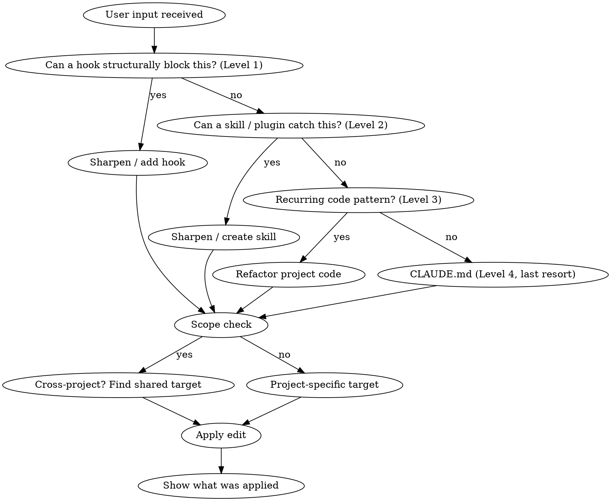
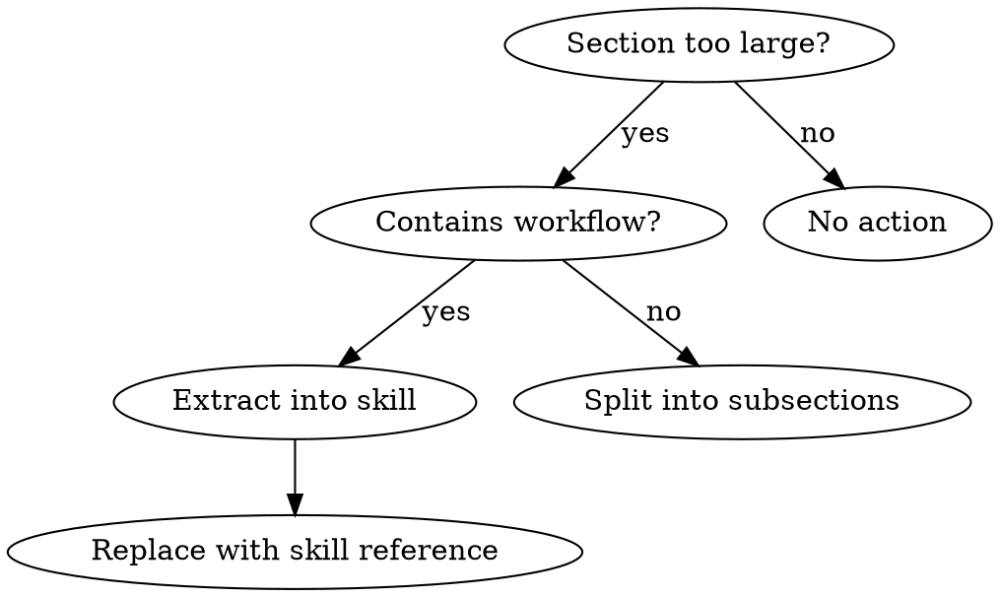

<post-update-broadcast>
BEFORE doing the actual work below, run this one-time check:

```bash
node "${CLAUDE_PLUGIN_ROOT}/bin/check-broadcast"
```

If the command produces output, the self-improvement plugin was updated since
the last time you saw the broadcast on this machine. Show the output
verbatim in a markdown block, prefixed with one short sentence
("self-improvement was updated; here is what changed."). Then continue with
the rest of this skill.

If the command produces no output, say nothing about updates and proceed.

The helper writes the sentinel only when stdout was non-empty, so a silent
run does not mark the version as seen. `/leclause:whats-new self-improvement`
re-shows the section on demand without touching the sentinel.
</post-update-broadcast>

# Self-Improvement

Update hooks, skills, project code, and CLAUDE.md files based on user feedback. CLAUDE.md is the **absolute last resort**, not the first reflex. Detects duplication, determines optimal location along two axes (enforcement strength and scope of applicability), can extract CLAUDE.md sections to skills, and creates new skills via TDD approach.

## STOP: walk both ladders before editing anything

Every piece of feedback gets classified along two axes before any edit. The failing pattern is: feedback arises in project P, around skill S, while running command C, and a rule gets pinned to P's CLAUDE.md because that is the nearest writable file. CLAUDE.md should almost never be the answer.

### Axis 1: enforcement ladder (highest to lowest)

Walk from 1 to 4 and stop at the first level that can structurally address the feedback. Do not skip levels.

1. **Hook / structural enforcement.** Can a hook fire on this? PreToolUse, PostToolUse, SessionStart, SessionEnd, UserPromptSubmit, Stop, or a git-native hook (commit-msg, pre-push). Settings.json deny rules count here too. Hooks fire deterministically regardless of which skill is loaded and regardless of how attentive the model is in the moment. If a hook can block or warn, the hook script is the target.
2. **Skill or plugin.** If no hook fits: is there an existing skill that should already cover this (and the wording needs sharpening), or does a new skill / plugin need to exist? Skill content reaches the model only when the description matches, but it carries more nuance than a hook reason.
3. **Project code.** If no skill fits: is the feedback pointing at a recurring pattern in the project code itself, where the same fix keeps being applied because the underlying structure keeps making the same mistake possible? Refactor the code (consolidate parallel paths, rename, add a type guard, delete dead lookalikes) so the trigger no longer exists. The user often phrases this as "elke keer dat we hier langskomen herhalen we dit patroon".
4. **CLAUDE.md.** Last resort. CLAUDE.md is text the model has to remember to apply under load; it drifts and is the weakest form of enforcement. Only when none of the three above can address the feedback structurally.

Other rungs may sit between these (helper scripts in `bin/`, test fixtures that pin behavior, type definitions, settings.json permission tuning). Treat the four named levels as a minimum, not an exhaustive list.

### Axis 2: scope ladder (broadest to narrowest)

After choosing the enforcement level, choose the scope. Walk from A to D and stop at the broadest scope where the principle still holds.

A. **Cross-project / language-agnostic.** The principle would apply equally in a Ruby project, a Swift project, a Go project. Target: a shared skill / plugin in this marketplace, or `~/.claude/README.md` for non-marketplace personal contexts. Never a single project's CLAUDE.md.
B. **Cross-project but language- or framework-specific.** Applies to all React projects, or all Rails projects, or all iOS projects. Target: a framework-scoped skill, or a shared README section that names the framework.
C. **One repo, multiple subprojects.** Target: that repo's root CLAUDE.md or a repo-level skill.
D. **One subproject only.** Target: that subproject's CLAUDE.md, or a subproject-scoped skill.

**Scope-underclaim is the most common drift.** The feedback arose in project P does NOT mean the target is P. Scope = where the principle applies, not where it was triggered. If you cannot say with conviction "this principle only applies to project P and would not apply to any sibling project", you have not yet reached the right level. A concrete recent failure mode worth remembering: the user-level rule "no pre-existing-test-failure claim without a baseline run on the mission base branch" arose during one iOS mission and got pinned to that one project's CLAUDE.md, despite being a generic commit-discipline rule that belongs in `gitgit:commit-discipline` (which already governs commit attestation and `Red-then-green` self-attestation). A waste of opportunity for growth: the same principle could have sharpened a marketplace skill and benefited every project, every language, every team member.

### Combining the two axes

The final target is the cell at the intersection of the enforcement level and the scope. Examples:

- Generic commit-discipline rule → enforcement level 1 (PreToolUse hook on `git commit`) or 2 (sharpen `gitgit:commit-discipline` skill), scope A (cross-project). Target: hook script or skill source under `packages/gitgit/`.
- "In this Rails app always use travel_to in time-sensitive specs" → enforcement level 4 (CLAUDE.md), scope B (Rails-specific). Target: the project's CLAUDE.md.
- "The same `pbxproj` corruption keeps happening on every xcodegen run" → enforcement level 3 (fix the project code or the xcodegen config), scope C (one repo). Target: that repo's xcodegen YAML.
- "Claude keeps using em-dashes in prose despite the existing hook" → enforcement level 1 (sharpen the existing `block-inline-dashes` hook reason), scope A. Target: the hook script's reason text.

**Default-bias correction.** The shortest path is to pin a rule to the nearest CLAUDE.md of the current working directory. That path is almost always wrong. The shortest path optimizes for "fastest to write" and ignores both "highest enforcement" and "broadest applicability". A skill or hook edit takes longer to write but reaches more sessions and resists drift; that is the trade /self-improvement is meant to lean into.

## Triggers

Activate when the user:
- Wants to adjust or improve a skill
- Wants to create a new skill
- Gives feedback about Claude's behavior during or about a skill invocation
- Gives feedback about Claude's general behavior ("doe dit voortaan anders")
- Corrects a pattern that recurs
- States a convention ("we doen het altijd zo")
- Says "onthoud dit" or "dit moet in m'n CLAUDE"
- Finds a CLAUDE.md section too large/complex
- Asks to consolidate instructions across projects

## Scope

Everything in the Claude Code ecosystem is fair game:

| Type | Location | When |
|------|----------|------|
| **CLAUDE.md** | `~/.claude/README.md` | General conventions (ONLY in personal context) |
| **CLAUDE.md** | `~/projects/**/CLAUDE.md` | Project-specific |
| **Skills** | `~/.claude/skills/**` | User-level workflows, tools |
| **Skills** | `packages/<plugin>/skills/**` | Plugin-level workflows (in marketplace projects) |
| **Hooks** | `~/.claude/hooks/**` | User-level guards, enforcement |
| **Hooks** | `packages/<plugin>/hooks/**` | Plugin-level guards (in marketplace projects) |
| **Hook reasons** | in hook scripts | Inline guidance always visible when the hook fires |
| **Settings** | `~/.claude/settings.json` | Permissions, allow/deny rules |
| **Scripts** | `~/.claude/bin/**` | Helper scripts |

## Plugin marketplace projects

**CRITICAL:** If the current project is a public plugin marketplace (indicators: `packages/*/` directory with `.claude-plugin/plugin.json` per package, or `.claude-plugin/marketplace.json` in root), then user-level CLAUDE.md changes are NOT a valid improvement. User-level is personal to one developer; a marketplace is used by others.

In such a project, improvements go into the relevant plugin itself:
- Behavior around a plugin hook, sharpen the hook reason in `packages/<plugin>/hooks/scripts/<hook>.sh`
- Workflow/pattern that belongs to the plugin, skill in `packages/<plugin>/skills/<skill-name>/`
- General docs, `packages/<plugin>/README.md`

On every `/self-improvement`, check first: is this a marketplace? `ls packages/*/.claude-plugin/plugin.json 2>/dev/null` answers the question. If yes, find the plugin the feedback belongs to and improve there.

## Level 1: Hook / structural enforcement

The first question on every piece of feedback. The hook reason is the only text Claude is GUARANTEED to see when the hook fires. A hook fires deterministically; a skill activates only on description match; a CLAUDE.md rule only reaches users of that same CLAUDE.md, and only when the model remembers to apply it.

When a hook already exists for the area: sharpen the reason. Name explicit anti-patterns in the text ("`🧭 dit was een reflex` is contradictory"). The reason text travels with every fire.

When no hook exists but one could: propose the hook event, the matcher, and the script location. For marketplace plugins, hook scripts live under `packages/<plugin>/hooks/scripts/<hook>.sh`; for personal use, `~/.claude/hooks/`. Wire the entry in the plugin's `hooks.json` or in `~/.claude/settings.json` under the matching event.

When the feedback concerns a hook the user encountered (escape-hatch misuse, unclear reason, the gate firing in the wrong situation): the hook script is the target. Do not write a CLAUDE.md rule about how to interact with the hook.

**Order of interventions inside Level 1:**

1. **First:** Sharpen the hook reason. Reason text is read every fire.
2. **Next:** Adjust the hook's matcher or detection logic, if the gate is firing on the wrong inputs.
3. **Adjacent:** Add a new hook only when the behavior is well-defined enough that a script can detect it programmatically.

If Level 1 cannot address the feedback, drop to Level 2.

## Level 2: Skill or plugin

When no hook can structurally block the behavior, the next question is whether a skill carries the right level of nuance. Skill content reaches the model only when the skill's description matches the current context, but skills can encode workflows, checklists, decision trees, and rationalization tables that a hook reason cannot fit.

Two flavors of Level 2 work:

**Sharpen an existing skill.** When the feedback names a skill, or when an existing skill already covers the broader area, the source is that skill's `SKILL.md`. If the principle is already there but is not being followed, the wording is too weak. Make it explicit: tie measurement to judgment, add a checkpoint, add a concrete counter-example from the current situation, add a red-flag thought to interrupt the rationalization in flight.

**Create a new skill or plugin.** When no skill covers the area but the workflow is well-defined and would benefit multiple sessions, draft a new skill. Use the TDD approach documented later in this file. In a marketplace project, the new skill lands under `packages/<plugin>/skills/<name>/` (existing plugin) or in a new plugin directory. Outside a marketplace, `~/.claude/skills/<name>/`.

**Locating skill sources.** Plugin skills live under `~/github.com/<owner>/<plugin-repo>/packages/<plugin>/skills/<name>/` or comparable plugin source. `~/.claude/plugins/cache/` is a cache and not a workplace; edits there are overwritten on the next `claude plugins update`. If the source is not local, find the upstream via `git config --get remote.origin.url` in `~/.claude/plugins/marketplaces/<owner>/`; check whether a sibling org under `~/github.com/` already has it before suggesting a clone.

**Scope check before editing a skill.** If the named skill belongs to one project but the principle is cross-project, the right target is a shared skill in the marketplace, not a one-project copy. Ask: would this same principle apply in a Ruby project, a Swift project, a Go project, a React project? If yes, look for an existing cross-project skill that already governs the area (`gitgit:commit-discipline`, `testing-philosophy`, `programming-philosophy`, `verification-and-diagnosis`) before extending a narrower one.

If Level 2 cannot address the feedback, drop to Level 3.

### Rationalizations that drift toward CLAUDE.md or toward narrow scope (do not do)

| Excuse | Reality |
|--------|---------|
| "This is general Claude behavior so CLAUDE.md" / "Dit is algemene Claude-gedrag dus CLAUDE.md" | No: the user triggered it during a skill or hook fire. The problem is that the skill / hook did not enforce the rule. |
| "The skill is in a cache, I cannot reach the source" / "De skill staat in een cache, ik kan niet bij de bron" | The source is under `~/github.com/<owner>/<plugin-repo>/`. Find it, do not re-clone. |
| "CLAUDE.md is faster to reach" / "CLAUDE.md is sneller bereikbaar" | Faster to reach does not solve the problem. CLAUDE.md does not reach the model at the moment the hook fires or the skill runs. |
| "The principle is already in the skill, so nothing can be added there" / "Het principe staat al in de skill, dus daar kan niks bij" | If the principle is there but is not being followed, it is too weakly worded. Sharpen it. See "/self-improvement ALWAYS means a change". |
| "CLAUDE.md is a broader catch" / "CLAUDE.md is een bredere vangst" | Broader CLAUDE.md is not more on-target. The specific hook / skill context wins in its own runtime. |
| "The user will probably want it in CLAUDE.md again" / "User zal het waarschijnlijk wel weer in CLAUDE.md willen" | That is a guess, not an observation. Read the feedback: does it name a skill or hook? Then skill or hook. |
| "The feedback came up in project P, so the rule belongs in P's CLAUDE.md" | Scope underclaim. Where the feedback arose is not the same as where the principle applies. Ask: would this rule hold in a sibling project? If yes, the target is cross-project (a marketplace skill or user-level), not P. |
| "There is no marketplace skill that exactly covers this area" / "Er is geen marketplace skill die hier precies over gaat" | Then look at the adjacent ones (`gitgit:commit-discipline`, `testing-philosophy`, `programming-philosophy`, `verification-and-diagnosis`). A near-adjacent skill that absorbs the rule beats a project-specific copy. |
| "This is iOS-specific (or Rails-specific, etc.) so it has to be project-level" | Language- or framework-specific is scope B, not scope D. A skill scoped to that framework still beats a single project's CLAUDE.md. |
| "Het raakt ook een generieke gate (push / test / verify) dus zet ik het ook in CLAUDE.md" / "It also touches a generic gate so I will edit CLAUDE.md too" | Skill-specifiek gedrag (hoe een specifieke skill een algemene regel interpreteert, een carve-out maakt, of zijn eigen surface invult) hoort UITSLUITEND in de skill. Wanneer de feedback gaat over hoe `/ship-it`, `/touche`, `/review-bot-party`, of een andere custom skill een algemene regel toepast, is de skill HET ENIGE doel. CLAUDE.md ook patchen verdubbelt de bookkeeping en vervuilt de algemene secties met workflow-nuance van één skill. De algemene CLAUDE.md-regel staat er al; de skill draagt zijn eigen interpretatie. |
| "Beide bewerken voor double enforcement" / "Editing both for double enforcement" | Double enforcement is in dit geval double trouble. De skill wint in zijn eigen runtime; CLAUDE.md hoeft niet te weten hoe een specifieke skill zijn eigen push/test/verify-surface interpreteert. Eén bron van waarheid per gedragsregel. |

### Red flags to recognize

If you catch yourself on one of these thoughts during /self-improvement, stop and re-walk both ladders:

- "Let me first read `~/.claude/README.md`" while the feedback names a skill or hook
- "I will add a rule to Werkwijze" / "Ik voeg een rule toe aan Werkwijze" without first having looked up the named skill or hook
- "The scan starts with Glob on CLAUDE.md" before you have established that this is Level 4 (CLAUDE.md) feedback
- Preparing an Edit on a project's CLAUDE.md while the principle would also hold in a sibling project
- Pinning a generic commit-discipline / test-discipline / verification-discipline rule to one project's CLAUDE.md instead of the corresponding shared skill (`gitgit:commit-discipline`, `testing-philosophy`, `verification-and-diagnosis`)
- Preparing an Edit call on `~/.claude/README.md` while you have not yet located a hook or skill source that could carry the rule with stronger enforcement
- Preparing edits on BOTH the source of a specific skill AND a user-level CLAUDE.md section for the same rule. Custom-skill behaviour belongs IN that skill, full stop. CLAUDE.md does not need to mirror how `/ship-it` (or any other skill) interprets its own surface.
- Justifying a CLAUDE.md edit with "het raakt ook de generieke push/test/verify regel" while the feedback came from a specific skill firing. The skill is the carry-target; the generic rule already exists.

Default route for skill feedback: `find ~/github.com -type d -name "<skill-name>" -path "*/skills/*"` to find the source, then Edit there.

## Level 3: Project code (eliminate the recurring trigger)

Sometimes the right fix is not in the Claude tooling at all; it is in the project code that keeps triggering the same correction. Signals:

- The same fix has been applied two or more times in the same area
- The same drift keeps appearing between two locations that should be in sync
- The same gotcha keeps biting (an ambiguous API, two functions with overlapping names, an implicit invariant)
- The user says "elke keer dat we hier langskomen", "weer", "alweer", "voor de zoveelste keer"

The structural fix is to make the mistake impossible:

- Consolidate two parallel paths into one (often a `/drydry:drydry` candidate)
- Rename a confusingly-named function or file so the mistake stops being inviting
- Move a constant out of two duplicated definitions into a shared module
- Turn a runtime check into a compile-time guard (types, contracts, schemas)
- Delete dead code that keeps being mistaken for live code
- Add a test that pins the invariant so the next break is caught at suite-time, not in production

Once the trigger is gone from the code, the behavior cannot recur, regardless of which skill is loaded or how attentive the model is. This level beats CLAUDE.md every time it applies. The drawback is that Level 3 work happens inside the project being audited, which means it touches more than the Claude config; it is real code work with real review implications. Worth it.

If Level 3 cannot address the feedback, drop to Level 4.

## Level 4: CLAUDE.md (absolute last resort)

CLAUDE.md is the catch for principles that:

- Cannot be hook-enforced (the model judgment required is too contextual for a script)
- Cannot live in a skill (the description would not match the contexts where the rule matters, or the rule is too general to belong to one skill's surface area)
- Cannot be designed away in code (the principle is about the model's working style, not about a code structure)

Even at Level 4, the scope ladder still applies: a CLAUDE.md rule in `~/.claude/README.md` (cross-project personal context) is broader than one in a project's CLAUDE.md, and a deviation-from-user-level note in a project's CLAUDE.md beats a duplicate of the user-level rule.

In a marketplace project, user-level CLAUDE.md is excluded as a target for plugin-related feedback (see "Plugin marketplace projects" above). Plugin-related feedback at Level 4 goes into `packages/<plugin>/README.md` or the relevant SKILL.md's prose, not into `~/.claude/README.md`.

## Workflow


```dot
digraph self_improvement {
  "User input received" -> "Can a hook structurally block this? (Level 1)"
  "Can a hook structurally block this? (Level 1)" -> "Sharpen / add hook" [label="yes"]
  "Can a hook structurally block this? (Level 1)" -> "Can a skill / plugin catch this? (Level 2)" [label="no"]
  "Can a skill / plugin catch this? (Level 2)" -> "Sharpen / create skill" [label="yes"]
  "Can a skill / plugin catch this? (Level 2)" -> "Recurring code pattern? (Level 3)" [label="no"]
  "Recurring code pattern? (Level 3)" -> "Refactor project code" [label="yes"]
  "Recurring code pattern? (Level 3)" -> "CLAUDE.md (Level 4, last resort)" [label="no"]
  "Sharpen / add hook" -> "Scope check"
  "Sharpen / create skill" -> "Scope check"
  "Refactor project code" -> "Scope check"
  "CLAUDE.md (Level 4, last resort)" -> "Scope check"
  "Scope check" -> "Cross-project? Find shared target" [label="yes"]
  "Scope check" -> "Project-specific target" [label="no"]
  "Cross-project? Find shared target" -> "Apply edit"
  "Project-specific target" -> "Apply edit"
  "Apply edit" -> "Show what was applied"
}
```

### Step 0: Walk both ladders

Before you scan anything, ask in order:

**Enforcement ladder (highest first):**

1. **Can a hook structurally block this?** (PreToolUse, PostToolUse, SessionStart, SessionEnd, UserPromptSubmit, Stop, git-native hooks like commit-msg / pre-push, settings.json deny rules). If yes, the hook reason or a new hook is the target. Go to "Level 1" above.
2. **Can a skill or plugin catch this?** If no hook fits but the feedback describes a workflow gap that a skill could carry: sharpen the existing skill or create a new one. Go to "Level 2" above.
3. **Is the project code itself the recurring trigger?** If the same fix keeps being applied because the project code keeps making the same mistake possible: refactor the code so the trigger no longer exists. Go to "Level 3" above.
4. **CLAUDE.md as last resort.** Only when none of the above can structurally address the feedback. Proceed to Step 1.

**Scope ladder (broadest first):**

Once the enforcement level is chosen, ask: where does this principle apply?

- A. Cross-project / language-agnostic → shared skill / marketplace plugin / user-level
- B. Cross-project but framework-specific → framework-scoped skill or shared section
- C. One repo, multiple subprojects → repo-level CLAUDE.md or repo-level skill
- D. One subproject only → subproject CLAUDE.md or subproject skill

**Default-bias correction.** The failing pattern is to jump straight to the nearest CLAUDE.md of the current working directory. That path optimizes for "fastest to write" and ignores both "highest enforcement" and "broadest applicability". A faster path to a weaker enforcement that helps fewer sessions is the wrong trade. Walk both ladders; do not skip rungs.

In doubt between a skill edit and a CLAUDE.md edit: default to the skill. The skill wins in its own runtime; CLAUDE.md does not. In doubt between a project-specific target and a cross-project target: default to cross-project. Where the feedback arose is not the same as where the principle applies.

### Step 1: Scan (only for CLAUDE.md feedback)

Use the Glob tool (not find/bash):

**For CLAUDE.md:**
```
# User-level (note: CLAUDE.md is a symlink to README.md)
Glob: ~/.claude/README.md

# All projects
Glob: ~/projects/**/CLAUDE.md
```

**For Skills:**
```
# User-level skills
Glob: ~/.claude/skills/**/SKILL.md

# Project-level skills
Glob: ~/projects/**/.claude/skills/**/SKILL.md
```

**Symlink note:** `~/.claude/CLAUDE.md` is a symlink to `~/.claude/README.md`.
Edits must go to `README.md`, not to the symlink.

Build a mental model:
- Which files exist
- Hierarchy per project (repo-root vs subdir)
- For skills: user-level vs project-level
- Language per file (read the first 50 lines)

### Step 2: Check duplication and conflicts

Look up whether the new instruction already (partially) exists:
- Exact same line?
- Same concept, different words?
- Contradictory instruction?

**On duplication:** Report this to the user with locations.

**On conflict:** Show both versions and propose synchronizing.

### Step 2b: Check staleness via git

User-level (`~/.claude`) is kept current more often than project-level (projects are sometimes temporarily abandoned). Check timestamps:

```bash
# User-level last change
git -C ~/.claude log -1 --format="%ci" -- README.md

# Project-level last change
git log -1 --format="%ci" -- CLAUDE.md
```

**Staleness detection:**

| User-level | Project-level | Action |
|------------|---------------|--------|
| More recent | Older | Project possibly stale, check for outdated instructions |
| Older | More recent | OK, project has specific updates |
| Conflict + user more recent | - | Propose updating project to user-level |

**When user-level is renewed:**
If you add/change an instruction in user-level, automatically scan all project CLAUDE.md's for:
1. Conflicting instructions (outdated version of the same concept)
2. Redundant instructions (now superfluous due to user-level)

Propose to update or clean up project-level.

### Step 3: Determine best location

The target is the intersection of the chosen enforcement level (Step 0, ladder 1) and the chosen scope (Step 0, ladder 2). Use the tables below as cross-references, not as the primary decision.

**Marketplace gate.** Is the current project a plugin marketplace (see "Plugin marketplace projects" above)? If so, user-level paths are EXCLUDED for feedback that belongs to a plugin. Improvements at any level land under `packages/<plugin>/...`.

**Scope-first sanity check before picking a target.** Ask "would this same principle apply in a sibling project, in another language, in another framework?" If the answer is yes for two of the three, the scope is A or B (cross-project), not C or D. A target in `~/projects/<owner>/<repo>/CLAUDE.md` is wrong for an A-scope principle, regardless of which project triggered the feedback.

**For hook reasons (Level 1):**

| Scope | Location |
|-------|----------|
| Cross-project, plugin-distributed | `packages/<plugin>/hooks/scripts/<hook>.sh` reason text |
| Cross-project, personal | `~/.claude/hooks/<hook>.sh` reason text |
| Project-specific gate | `.git/hooks/` or repo-level pre-commit config |

**For skills (Level 2):**

| Scope | Location |
|-------|----------|
| Workflow usable in all projects, marketplace-shareable | `packages/<plugin>/skills/<name>/` (existing or new plugin) |
| Workflow usable in all projects, personal | `~/.claude/skills/<name>/` |
| Framework-specific workflow, marketplace-shareable | `packages/<framework-plugin>/skills/<name>/` |
| Repo-specific workflow | `<repo>/.claude/skills/<name>/` |
| Subproject-specific workflow | `<repo>/<subdir>/.claude/skills/<name>/` |

**For project code (Level 3):**

| Signal | Location |
|--------|----------|
| Same fix applied 2+ times in same area | Refactor that area; consolidate parallel paths |
| Drift between two locations that should be in sync | Single source of truth; one definition imported by both |
| Ambiguous API keeps biting | Rename; introduce a type guard; delete the ambiguous lookalike |
| Implicit invariant keeps being violated | Add a test pinning the invariant; add a runtime assertion at the boundary |

**For CLAUDE.md (Level 4, last resort):**

| Scope | Location |
|-------|----------|
| Applies to ALL projects (personal context) | `~/.claude/README.md` (user-level) |
| Applies to all projects of a framework | Section in the relevant project's CLAUDE.md, replicated across projects via a `/self-improvement` consolidation pass |
| Applies to one specific repo | That repo's root CLAUDE.md |
| Applies to one subproject inside a repo | That subproject's CLAUDE.md |
| Already in 3+ project CLAUDE.md's identically | Consolidate to user-level or extract to a skill (see "CLAUDE.md -> Skill Extraction" below) |

**Hierarchy within a project:**
- Repo-root CLAUDE.md: general project conventions
- Subdir CLAUDE.md: specific to that subdir (e.g., webapp for Rails)

**Load order and priority:**

Claude Code loads all CLAUDE.md's and concatenates them in the system prompt:
1. User-level (`~/.claude/CLAUDE.md`), first
2. Project-level (repo root), next
3. Subproject-level (working directory), last

There is **no explicit override mechanism**. On conflicts:
- Later instructions often carry more weight (recency bias), but not guaranteed
- Specificity usually wins over generality
- **Explicit deviations work best**

**For project-specific deviations:**
```markdown
## Deviation from user-level

In this project we DO use comments on public APIs
(contrary to the general "no comments" rule).
```

### Project-Agnostic Phrasing (for user-level)

User-level instructions must work for Ruby, Swift, Go, Python, JavaScript, etc., without confusion.

**Principles:**

| Avoid | Use instead |
|-------|-------------|
| Language-specific syntax | Conceptual description |
| Framework-specific tools | Generic tool categories |
| Concrete examples from one language | Principle + "apply to your language" |

**Transformation examples:**

```
# Too specific (Swift)
if rewind > threshold { skip }  // FORBIDDEN

# Agnostic
Defensive filtering (skipping/ignoring values) hides bugs.
```

```
# Too specific (iTerm2)
Look in pane 2 to see if it works -> FORBIDDEN

# Agnostic
Verify yourself with available tools. Do not ask the user to look.
```

```
# Too specific (RSpec)
Avoid let/let! memoizations, use local variables

# Agnostic
Avoid test-level memoization/setup where local variables suffice.
```

**Checklist for user-level instructions:**

- [ ] Contains no language-specific keywords (`def`, `func`, `fn`, `function`)
- [ ] Contains no framework-specific names (Rails, SwiftUI, React)
- [ ] Contains no tool-specific commands (bundle, swift, npm)
- [ ] Principle applies to any language/stack
- [ ] When in doubt: "does this fit a Go project? A Ruby project? A Swift project?"

### Step 4: Determine language

Detect the language of the target file:

```
If >50% Dutch words -> Dutch
If >50% English words -> English
When in doubt -> check "Language" section in the file
```

**User-level (`~/.claude/`):** Always Dutch. This applies to
CLAUDE.md, README.md, AND all user-level skills in `~/.claude/skills/`.

**Project-level:** Follows the project language. Some project skills (`.claude/skills/`)
are English because the project prescribes English for code and configuration.

Write the new instruction in the language of the target file.

### Step 5: Apply directly

Apply the change directly with the Edit tool. Do not ask for approval; the user has already made their intent clear by giving the feedback.

**Check after edit:**
- File ends with newline
- No double blank lines created
- Formatting consistent with the rest of the file

### Step 6: Show what was applied

Give a short summary of the change:
- **File:** (path)
- **What was added:** (1-2 sentences)
- **Rationale:** (why this location)

Keep it short, do not show a full diff, only confirm what happened.

### Step 7: Commit user-level changes

`~/.claude` is tracked in git. Changes to user-level CLAUDE.md or skills can be committed.

**Commit workflow (same as always):**
1. Edit has been applied and the user has validated that it is correct
2. Ask whether the user wants to commit
3. On "yes": commit with a descriptive message

```bash
# From any directory (no cd needed)
git -C ~/.claude add README.md  # or skills/skill-name/
git -C ~/.claude commit -m "Add principle: hiding symptoms is forbidden"
```

**Note:** Normal commit intent validation applies here too. The user must confirm that the change is correct before you commit.

## Consolidation Mode

When you detect duplication across multiple projects:

```markdown
## Duplication detected

The following instruction is in 3 projects:

| Project | File | Line |
|---------|------|------|
| my-project | CLAUDE.md | 45 |
| my-other-project | CLAUDE.md | 23 |
| my-app | CLAUDE.md | 31 |

**Proposal:** Consolidate to ~/.claude/CLAUDE.md and remove from project files.

OK?
```

## Examples

Each example walks both ladders and lands on a specific target.

**User:** "Voortaan geen emoji's in commit messages"

-> Enforcement: Level 1 (a commit-msg hook can detect emoji unicode ranges; pre-commit / `commit-msg` hook beats remembering a rule).
-> Scope: A (cross-project, language-agnostic).
-> Target: a new check in `gitgit:commit-discipline` or its `commit-msg` hook, not user-level CLAUDE.md.

**User:** "In dit Rails project altijd `travel_to` gebruiken in specs"

-> Enforcement: Level 4 (no hook can detect missing `travel_to`; the call is contextual). Level 2 candidate: extending `testing-philosophy` if the principle generalizes.
-> Scope: B (Rails-specific, cross-project if the team has multiple Rails repos) or D (this one project).
-> Target: if B, add to `testing-philosophy` or a Rails-scoped section in a shared skill; if D, the project's CLAUDE.md `Testing` section.

**User:** "Stop met die Co-Authored-By trailer"

-> Enforcement: Level 1 (already enforced by `gitgit:commit-trailers` guard) AND Level 4 (already in user-level CLAUDE.md).
-> Report: already covered at the highest enforcement level; no further edit needed unless the rule is being bypassed despite the hook. If bypassed, check the hook's bypass conditions, not CLAUDE.md.

**User:** "Geestig hoe kan het dan dat we al die tijd lekker committen zonder tests te draaien?"

-> Enforcement: Level 2 (sharpen `gitgit:commit-discipline` which already governs `Red-then-green` self-attestation), or Level 1 if a `pre-push` hook can detect a missing test run via timestamp comparison.
-> Scope: A (every language has tests; the discipline of running them before claiming green is universal).
-> Anti-pattern to avoid: pinning "always run a baseline on the mission base branch before claiming pre-existing failure" to one iOS project's CLAUDE.md. That principle holds in any test framework, on any language, and belongs in the marketplace `gitgit:commit-discipline` skill where it benefits every session, not just iOS work.

## /self-improvement ALWAYS means a change

When the user types `/self-improvement`, the expectation is that something changes. Always. No exceptions.

**"It's already there" is not a valid answer.** If the principle is already there but is not being followed, the wording is apparently not strong enough. Sharpen the existing text, add an example, or rephrase so that it does work.

**"No action needed" does not exist on an explicit /self-improvement.** The user deliberately triggered the skill. That means something is wrong in how the system works. Find it and improve it.

## /self-improvement together with a work request

The user often types `/self-improvement` in combination with feedback about a concrete situation. That means two tasks:

1. **Config change:** adjust CLAUDE.md or skill so the behavior changes structurally
2. **The work itself:** apply the principle to the current situation

Always do both. If the work is already done (in an earlier step of the conversation), verify that it has been completed correctly. If not, do it anyway. The config change without applying the work is a half solution. Doing the work without adjusting the config means the next conversation makes the same mistake.

## No CLAUDE.md update needed

Sometimes feedback is not suitable for CLAUDE.md (but something always changes, even if only in a skill):
- One-off correction ("no, I meant X") -> apply correction
- Project choice ("use library Y") -> apply
- Factual information ("the API endpoint is Z") -> apply

---

## CLAUDE.md -> Skill Extraction

When a CLAUDE.md section becomes too large, extract it into a skill.

### When to extract?

| Signal | Action |
|--------|--------|
| Section > 50 lines | Consider extraction |
| Section contains workflow with steps | Extract into skill |
| Section contains decision tree/flowchart | Extract into skill |
| Same instructions in 3+ CLAUDE.md's | Consolidate into user-level skill |
| Instructions are context-dependent | Keep in CLAUDE.md |

### CLAUDE.md vs Skill

| CLAUDE.md | Skill |
|-----------|-------|
| Passive context, always loaded | Active workflow, opt-in |
| Conventions, standards | Procedures, tools |
| Short and scannable | Extensive with examples |
| "What we do" | "How we do it" |

### Extraction workflow


```dot
digraph extraction {
  "Section too large?" -> "Contains workflow?" [label="yes"]
  "Contains workflow?" -> "Extract into skill" [label="yes"]
  "Contains workflow?" -> "Split into subsections" [label="no"]
  "Extract into skill" -> "Replace with skill reference"
  "Section too large?" -> "No action" [label="no"]
}
```

**After extraction:** Replace the CLAUDE.md section with a short reference:

```markdown
## Git Workflow

See `/git-workflow` skill for commit and PR procedures.
```

---

## Creating and Improving Skills

### Skill Types

| Type | Description | Example |
|------|-------------|---------|
| **Technique** | Concrete method with steps | `condition-based-waiting` |
| **Pattern** | Way of thinking about problems | `flatten-with-flags` |
| **Reference** | API docs, syntax guides | `pptx` |

### Skill Level Determination

| Criterion | Level | Location |
|-----------|-------|----------|
| Usable in all projects | User | `~/.claude/skills/{name}/` |
| Specific to a repo | Repo | `{repo}/.claude/skills/{name}/` |
| Specific to subproject | Subproject | `{repo}/{subdir}/.claude/skills/{name}/` |

**Examples:**
- `vocal` (voice control) -> User-level (works everywhere)
- `bump` (dependency updates) -> Repo-level (project-specific)
- `screenshots` (Playwright) -> Subproject-level (webapp)

### SKILL.md Structure

```markdown
---
name: skill-name-with-hyphens
description: Use when [triggering conditions]. Third person, max 500 chars.
user-invocable: true  # only if manually invocable
---

# Skill Name

## Overview
What is this? Core principle in 1-2 sentences.

## When to Use
Bullet list with symptoms and use cases.
When NOT to use.

## Workflow
[Flowchart if non-linear]

## Quick Reference
Table or bullets for quick scanning.

## Common Mistakes
What goes wrong + fixes.
```

### Frontmatter Pitfalls

**`disable-model-invocation: true` blocks the Skill tool entirely.**
When this is set, Claude cannot load the skill via the Skill tool, not even when the user types `/skillname` inline in a message. The skill is then only reachable via the `/` autocomplete menu in the CLI.

Do NOT use `disable-model-invocation: true` unless the skill:
- Has destructive side effects (deploy, delete, push)
- Must never be triggered automatically by Claude

For skills that the user invokes inline (e.g., `/clipboard` at the end of a message): leave out `disable-model-invocation`.

**`allowed-tools` works only when the skill is loaded.**
If the skill does not load (due to `disable-model-invocation` or another reason), the `allowed-tools` are not active and a permission prompt still appears.

### Permission Management on Skill Creation

A skill without permissions is a skill with five approval prompts. When creating or modifying skills, ALWAYS check two things:

**1. `Skill()` in `~/.claude/settings.json` allowlist**

Every user-level skill that Claude may load must be in the allowlist:

```json
"Skill(skill-name)"
```

Without this, a prompt appears on every invocation, even if the user types `/skill-name`.

**2. `allowed-tools` in SKILL.md frontmatter**

Skills that use tools that are NOT already globally in the allowlist must declare `allowed-tools`:

```yaml
---
name: my-skill
allowed-tools:
  - Bash(some-command *)
  - Write(**/output.*)
---
```

**When `allowed-tools` is NOT needed:** if the skill uses only tools that are already globally allowed (e.g., `say`, `gh`, `git`, Read/Edit/Glob on `~/.claude/**`). Check the allowlist in `~/.claude/settings.json`.

**When `allowed-tools` IS needed:** if the skill does Edit/Write on project files, spawns Task agents, or uses non-standard Bash commands.

**When creating a new skill:**
1. Write the SKILL.md with correct `allowed-tools`
2. Add `Skill(name)` to the `~/.claude/settings.json` allowlist
3. Both steps are needed for a prompt-free experience

### Description Best Practices

**CRITICAL:** Description = when to use, NOT what the skill does.

```yaml
# WRONG: Describes workflow
description: Dispatches subagent per task with code review between tasks

# RIGHT: Describes trigger
description: Use when executing implementation plans with independent tasks
```

**Why:** Claude reads the description to decide whether the skill is relevant. If the description summarizes the workflow, Claude may follow the summary instead of reading the full skill.

### Naming Conventions

- **Use hyphens:** `self-improvement` not `self_improvement`
- **Verb-first:** `creating-skills` not `skill-creation`
- **Gerunds work well:** `debugging-with-logs`, `testing-skills`
- **Letters, digits, hyphens only:** no special characters

### Keyword Coverage (CSO)

Use words Claude would search for:
- Error messages: "Hook timed out", "race condition"
- Symptoms: "flaky", "hanging", "slow"
- Tools: command names, library names

### File Organization

```
skills/
  skill-name/
    SKILL.md              # Main file (required)
    supporting-file.*     # Only if needed (100+ lines reference)
```

**Keep inline:** Principles, code patterns < 50 lines
**Separate file:** Heavy reference (API docs), reusable scripts

---

## Creating a New Skill (TDD Approach)

Writing skills IS Test-Driven Development for documentation.

### The Golden Rule

```
NO SKILL WITHOUT A FAILING TEST FIRST
```

Wrote the skill before the test? Delete. Start over.

### RED-GREEN-REFACTOR for Skills

**RED: Capture baseline (without skill)**

Test with a subagent WITHOUT the skill loaded:
```
Task tool -> subagent_type: "general-purpose"
Prompt: [scenario the skill should address]
```

Document:
- What did the agent do?
- Which wrong choices did it make?
- Which rationalizations did it use? (quote literally)

**GREEN: Write the minimal skill**

Write only what is needed to fix the baseline failures.
- Address the specific rationalizations from RED
- Do not add hypothetical cases

Test again WITH the skill. The agent must now act correctly.

**REFACTOR: Close loopholes**

Did the agent find a new rationalization? Add an explicit counter.
Repeat until bulletproof.

### Pressure Scenarios

For discipline-enforcing skills (rules that must be followed):

| Pressure Type | Example |
|---------------|---------|
| **Time** | "This needs to be done quickly" |
| **Sunk cost** | "I've already done so much" |
| **Authority** | "The user said it had to be this way" |
| **Exhaustion** | At the end of a long task |

Combine 3+ pressures in test scenarios.

### Rationalization Table

Document EVERY rationalization that agents use:

```markdown
| Excuse | Reality |
|--------|---------|
| "Too simple to test" | Simple code breaks too. The test takes 30 seconds. |
| "I'll test later" | Tests after the fact prove nothing. |
| "This is different because..." | No. Rules apply always. |
```

### Red Flags Section

Add to discipline skills:

```markdown
## Red Flags - STOP and Start Over

If you catch yourself on:
- [specific rationalization 1]
- [specific rationalization 2]
- "This is different because..."

-> You are rationalizing. Stop. Follow the skill.
```

### Skill Creation Checklist

**RED phase:**
- [ ] Pressure scenarios designed (3+ pressures for discipline skills)
- [ ] Scenarios run WITHOUT skill
- [ ] Baseline behavior documented (literal quotes)

**GREEN phase:**
- [ ] Name: only letters, digits, hyphens
- [ ] Description: "Use when...", max 500 chars, NO workflow summary
- [ ] Addresses specific baseline failures
- [ ] Scenarios run WITH skill, agent now follows correctly

**REFACTOR phase:**
- [ ] New rationalizations identified
- [ ] Explicit counters added
- [ ] Rationalization table complete
- [ ] Red flags section (for discipline skills)

**Deploy:**
- [ ] Commit to git
- [ ] Test in fresh session

---

## Skill Improvement Workflow

When an existing skill must be improved:

1. **Read current skill** fully
2. **Identify the problem:**
   - Unclear instructions?
   - Missing edge cases?
   - Outdated information?
3. **Apply directly** with the Edit tool
4. **Show what was applied** (file, section, change)

### Example Skill Improvement

**User:** "De vocal skill moet ook kunnen pauzeren"

```markdown
## Proposal

**File:** ~/.claude/skills/vocal/SKILL.md
**Section:** Invocation (existing)

### To add after line 12:

\`\`\`diff
 - `/vocal` or `/vocal on` - Enter vocal mode
 - `/vocal off` - Exit vocal mode
+- `/vocal pause` - Pause listening, keep speaking
+- `/vocal resume` - Resume listening
\`\`\`

**Why here:** Fits existing invocation documentation.
```
